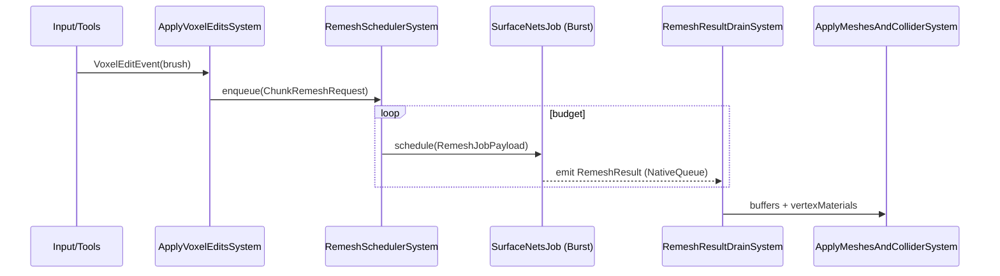
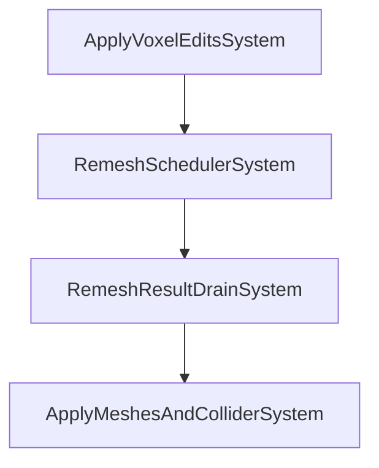

## Systems, Events, and Data Structures (Unity C# + Burst/Jobs)

### Purpose
Define the concrete runtime architecture (systems, events, and data structures) for the Unity implementation, consistent with `_Spec/spec.md`, `_Spec/materials_vertex_color_spec.md`, and `_Spec/implementation_plan_unity.md`. Emphasis: background jobified workflow, apron semantics, single-mesh-per-chunk, and TDD.

---

## Systems

### Startup & Configuration
- **VolumeBootstrapSystem**
  - Spawns/initializes `VoxelVolume` GameObjects and their chunk children based on `VolumeConfig`.
  - Allocates `VoxelChunkStorage` for each chunk; fills defaults.
  - Optionally queues initial remesh for all chunks (or visible subset).

- **MaterialLibraryInitSystem**
  - Initializes `VoxelMaterialLibrary` used by the triplanar shader (palette/debug arrays, params).

### Editing & Dirty Mapping
- **ApplyVoxelEditsSystem**
  - Reads `VoxelEditEvent` stream; applies brush ops to overlapping chunks.
  - Writes/retains material annotations alongside SDF edits (e.g., on sign transitions); only SDF determines inside/outside; the mesher later encodes the annotation into vertex color. Maintains interior-only writes.
  - Computes affected chunk coords from edit AABBs and enqueues them into `RemeshQueue` (deduped); tags `NeedsRemesh`.

### Scheduling & Jobs
- **RemeshSchedulerSystem**
  - Pops up to budget from `RemeshQueue` while time/quantity budget remains.
  - Packages `RemeshJobPayload` and schedules Burst jobs (one per chunk).
  - Ensures apron border values are available by copying neighbor edges inline when needed during job setup (no separate apron-fix system).
  - Tracks outstanding jobs/handles; provides `ParallelWriter` for result emission.

### Async Meshing & Results
- **SurfaceNetsJob (Burst)**
  - Input: `sdf[]` (32³), `mat[]` (32³), dims, voxel size; processes core cells, uses apron for corners/gradients.
  - Output: `SurfaceNetsBuffer { positions, normals, indices }` and `vertexMaterials: NativeArray<byte>`.
  - Fast-path: skip when field is entirely positive or negative (incl. apron).

- **RemeshResultDrainSystem**
  - Main thread. Drains `NativeQueue<RemeshResult>` produced by jobs; enqueues `ApplyMeshTask` for the same frame.

### Apply Meshes & Physics
- **ApplyMeshesAndColliderSystem**
  - Main thread. Converts buffers to Unity `Mesh` with `ATTRIBUTE_COLOR` encoding material id in `color.r = id/255.0`.
  - Updates/creates MeshFilter/MeshRenderer per chunk (single mesh per chunk).
  - Rebuilds or updates colliders from render mesh triangles with debounce and clears flags.

 

---

## Events

- **VoxelEditEvent**
  - Source: input/tools/runtime. Payload: `Brush`, `GlobalTransform`, `EditOp`.
  - Consumed by: `ApplyVoxelEditsSystem`.

- **ChunkRemeshRequest (internal)**
  - Source: `ApplyVoxelEditsSystem`, bake load/hot-reload, visibility changes.
  - Payload: chunk entity/id, priority hints.
  - Consumed by: `RemeshSchedulerSystem` via `RemeshQueue`.

- **ChunkRemeshResult (internal, job→main)**
  - Source: `SurfaceNetsJob` writing to `NativeQueue<RemeshResult>.ParallelWriter`.
  - Payload: chunk id, `SurfaceNetsBuffer`, `vertexMaterials`.
  - Consumed by: `RemeshResultDrainSystem` → `ApplyMeshesSystem`.

- **ChunkStorageReplaced**
  - Source: bake hot-reload or re-seeding.
  - Payload: chunk id; pointers to new `sdf[]/mat[]`.
  - Consumed by: `RemeshSchedulerSystem` (inline apron availability during job setup).

- **MaterialLibraryChanged**
  - Source: debug palette/material param edits.
  - Consumed by: shader/material updater (optional live tweaks).

---

## Data Structures

### Core Layout & Indexing
```csharp
public struct ChunkDims {
    public const int CoreX = 30, CoreY = 30, CoreZ = 30;
    public const int SampleX = CoreX + 2, SampleY = CoreY + 2, SampleZ = CoreZ + 2; // 32³
    public const int SampleCount = SampleX * SampleY * SampleZ; // 32_768
}

public static class GridIndexing {
    public static int LinearIndex(int x, int y, int z) => x + ChunkDims.SampleX * (y + ChunkDims.SampleY * z);
    public static bool IsInterior(int x, int y, int z) => x > 0 && x < ChunkDims.SampleX - 1 && y > 0 && y < ChunkDims.SampleY - 1 && z > 0 && z < ChunkDims.SampleZ - 1;
}
```

### Volume & Chunks
```csharp
public struct VolumeConfig {
    public float voxelSize;
    public int3 gridDims;    // number of chunks in x,y,z
    public int3 origin;      // world-voxel origin offset
}

public sealed class VoxelVolume : MonoBehaviour {
    public VolumeConfig Config;
    public VoxelMaterialLibrary Materials;
    public List<VoxelChunk> Chunks = new List<VoxelChunk>();
}

public sealed class VoxelChunk : MonoBehaviour {
    public int3 Coords;                 // chunk grid coordinates
    public VoxelChunkStorage Storage;   // SDF + material SoA
    public bool NeedsRemesh;
    public bool NeedsCollider;
    public MeshFilter MeshFilter;
    public MeshRenderer MeshRenderer;
}
```

### Storage (SoA with apron)
```csharp
public struct VoxelChunkStorage : System.IDisposable {
    public NativeArray<float> sdf; // length = 32³
    public NativeArray<byte> mat;  // length = 32³ (u8 annotation per sample)

    public void Initialize(Allocator allocator, float fillSdf, byte defaultMat) {
        sdf = new NativeArray<float>(ChunkDims.SampleCount, allocator, NativeArrayOptions.UninitializedMemory);
        mat = new NativeArray<byte>(ChunkDims.SampleCount, allocator, NativeArrayOptions.UninitializedMemory);
        sdf.AsSpan().Fill(fillSdf);
        mat.AsSpan().Fill(defaultMat);
    }
    public void Dispose() { if (sdf.IsCreated) sdf.Dispose(); if (mat.IsCreated) mat.Dispose(); }
}
```

### Editing
```csharp
public enum EditOp { Place, Destroy }

public struct Brush {
    public BrushShape Shape;
    public EditOp Operation;
    public byte MaterialId; // used on Place sign-transitions
}

public enum BrushShapeKind { Sphere, Box, Cone }

public struct BrushShape { // example; extend as needed
    public BrushShapeKind Kind;
    public float3 Center;
    public float3 HalfExtents; // for box/cone; use radius in X
    public float Radius;       // for sphere/cone
    public float SmoothK;      // smooth ops
}
```

### Meshing buffers
```csharp
public struct SurfaceNetsBuffer {
    public NativeList<float3> positions;
    public NativeList<float3> normals;
    public NativeList<int> indices; // triangle list
}

public struct RemeshJobPayload {
    public int chunkId;
    public NativeArray<float> sdf;
    public NativeArray<byte> mat;
    public float voxelSize;
}

public struct RemeshResult {
    public int chunkId;
    public SurfaceNetsBuffer buffer;
    public NativeArray<byte> vertexMaterials; // length == positions.Length
}
```

### Scheduling & Budgets
```csharp
public struct RemeshBudget {
    public int maxChunksPerFrame;
    public float timeSliceMs;
}

public sealed class RemeshQueue {
    private readonly Queue<int> queue = new Queue<int>();
    private readonly HashSet<int> dedupe = new HashSet<int>();

    public bool Enqueue(int chunkId) {
        if (!dedupe.Add(chunkId)) return false;
        queue.Enqueue(chunkId);
        return true;
    }
    public bool TryDequeue(out int chunkId) {
        if (queue.Count == 0) { chunkId = default; return false; }
        chunkId = queue.Dequeue();
        dedupe.Remove(chunkId);
        return true;
    }
}
```

### Materials
```csharp
public static class VoxelMaterials { }

public sealed class VoxelMaterialLibrary : ScriptableObject {
    public Color[] debugPalette = new Color[256];
    // future: per-material params/textures for triplanar
}
```

---

## Flow Diagrams

### Edit → Remesh → Apply (sequence)


### System update order (frame)


---

## Invariants & Rules
- Arrays sized to samples (32³). Interior indices per axis are `1..30`; aprons at `0` and `31` are read-only.
- Only core cells emit Surface Nets vertices; terminal +X/+Y/+Z cell layer excluded.
- No reserved material ids; treat all `u8` values as annotations.
- Per-vertex material id selected from the 8 cell corners by minimal `abs(sdf)`; ties resolved deterministically.
- All heavy computation runs in Burst jobs; main thread only mutates UnityEngine objects (Meshes, Renderers, Colliders).
- Remesh queue dedupes chunk ids; scheduler respects both count and time-slice budgets.
- Colliders update with debounce to avoid rebuild thrash.

---

## Testing Notes (TDD)
- Core indexing/apron tests validate interior ranges and linearization round-trips.
- Storage tests validate size, initialization, and interior-only writes.
- Meshing tests validate empty/solid skips, vertex counts on synthetic shapes, and material labeling.
- Editing tests validate sign-transition material updates and affected-chunk mapping.
- Scheduler tests validate budget adherence and dedupe behavior.
- Rendering tests validate vertex color encoding/decoding of material id.


