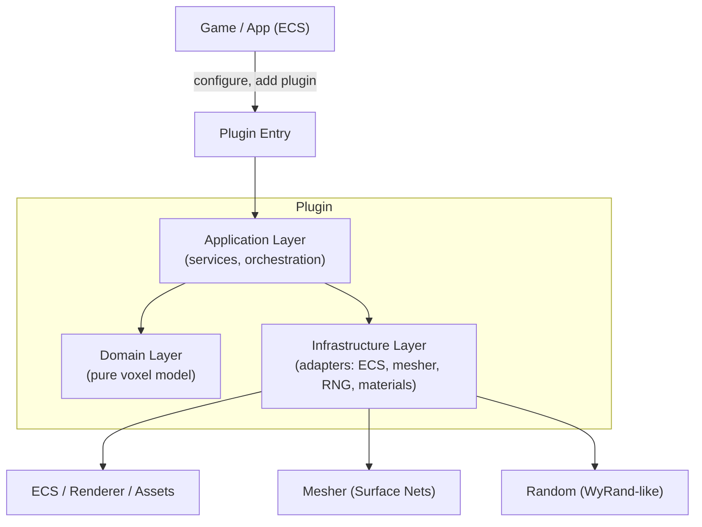
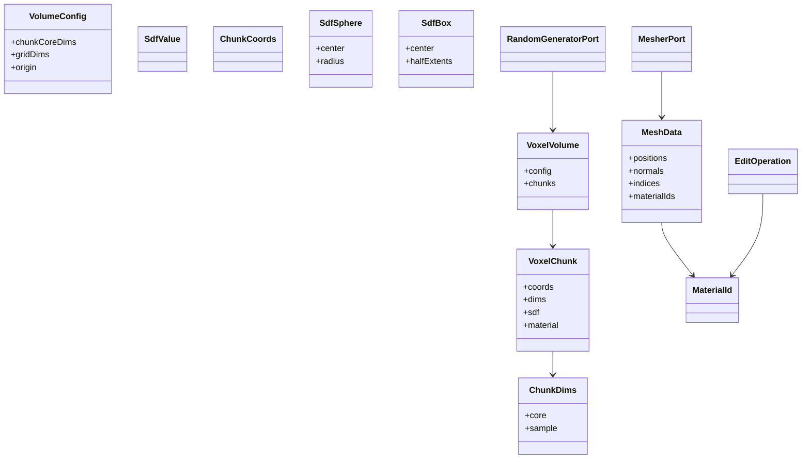
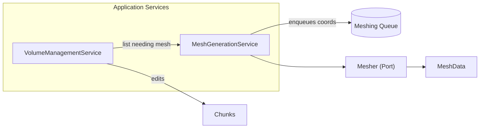
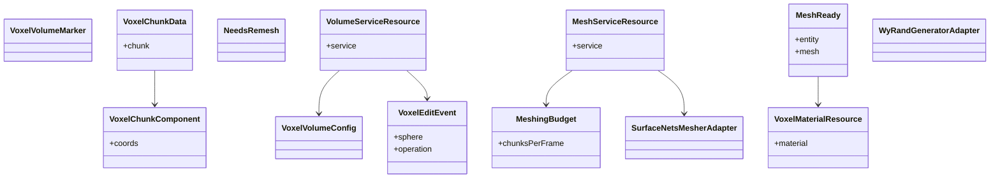
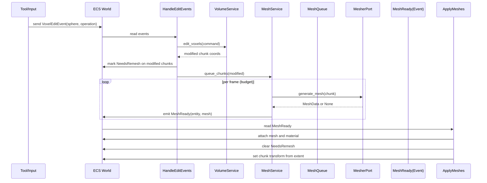
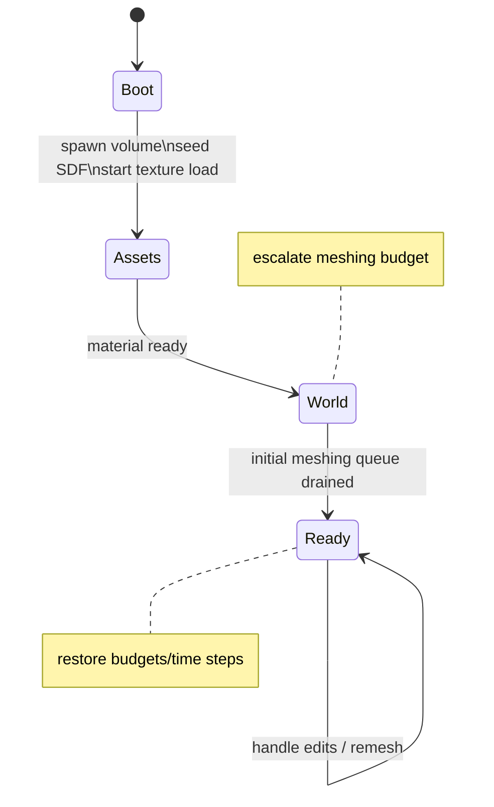
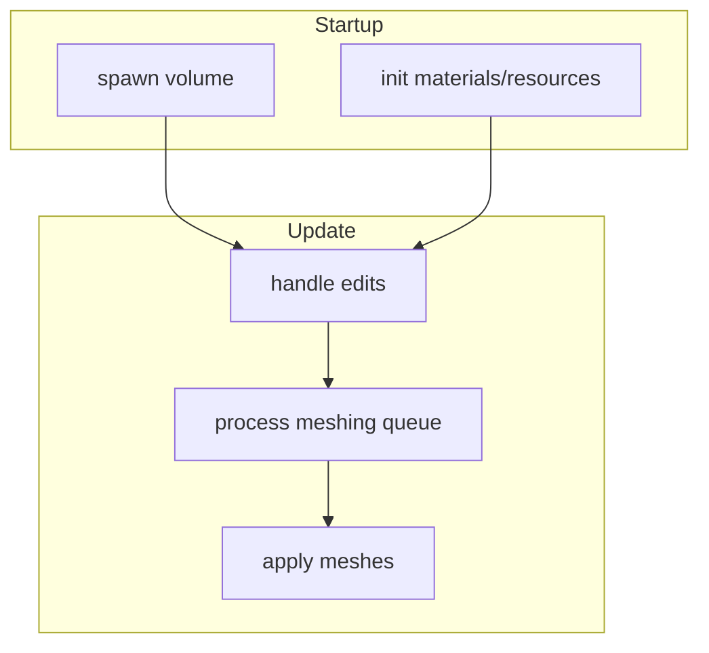

## Voxel Plugin Architecture Specification (Language-agnostic ECS)

### Purpose
Defines a portable, engine-agnostic architecture for a voxel engine plugin built on ECS and event streams. This document decouples domain logic from framework/runtime concerns to enable reimplementation in C# or other environments while preserving ECS patterns (components, systems, resources) and event-driven workflows.

### High-level decomposition
- Domain layer: Pure voxel model and algorithms (no engine/framework dependencies).
- Application layer: Use-cases/services orchestrating domain and ports.
- Infrastructure layer: Adapters for engine/runtime (ECS components, materials, rendering meshes, RNG, mesher).
- Plugin entry: Wires ECS schedules, resources, events, and systems.

### ECS assets
- Components (per-entity data): identify voxel volume and chunks; hold chunk data and remesh markers.
- Resources (global data/services): configuration, services (volume management, meshing), budgets/materials.
- Events (typed streams): voxel edits, mesh-ready notifications.
- Systems (pure functions over ECS data): react to events; update data; schedule work; convert domain meshes to renderable assets.
- States (optional): drive boot/asset/world/ready transitions to control startup and background workloads.

### Domain model (pure)
- Voxel types: `MaterialId`, `SdfValue`, `ChunkDims`, `ChunkCoords`, `LocalVoxelPos`, `WorldVoxelPos`.
- Primitives: `SdfSphere`, `SdfBox` and CSG operations.
- Entities: `VoxelChunk` (SDF + material grids), `VoxelVolume` (grid of chunks, with `VolumeConfig`).
- Mesh: `MeshData` (positions, normals, indices, material ids per-vertex).
- Ports (capabilities): `Mesher` (chunk -> MeshData?), `RandomGenerator`.

### Application layer (use-cases)
- VolumeManagementService
  - Create new volumes from `VolumeConfig`.
  - Apply edits (sphere-based place/destroy) to chunks; return modified chunk coordinates.
  - Seed volumes (procedural generation) using `RandomGenerator`.
  - Query chunks needing mesh.
- MeshGenerationService
  - Maintain a queue of chunk coordinates requiring remesh.
  - Process queue up to a per-frame budget, invoking `Mesher` port and producing `MeshData` (or None when empty).

### Data structures and memory layout (SoA)

- Voxel chunk storage uses Structure of Arrays (SoA) for cache-friendly iteration and SIMD/vectorization.
  - SDF values: contiguous array of 32-bit floats.
  - Material IDs: contiguous array of 8-bit integers (annotation per sample; no reserved ids).
- Each chunk maintains two aligned arrays of equal length: one for SDF and one for material IDs; both indexed identically.

- Dimensions
  - Core dims: interior editable voxels, `core = [Nx, Ny, Nz]`.
  - Sample dims: allocated grid including a 1-voxel apron on all faces, `sample = core + [2,2,2]`.
  - Sample count: `sample_len = sample.x * sample.y * sample.z`.
  - Fixed size: sample 32³; core 30³.

- Apron semantics
  - The +1 apron stores neighbor boundary samples to generate surfaces without cracks at chunk borders.
  - Local sample coordinates `x∈[0..sample.x-1]` include the apron; the core spans `x∈[1..sample.x-2]`.
  - World transform for a chunk aligns the entity to the sample extent minimum (apron-inclusive origin).

- Linear indexing
  - For sample dims `[sx, sy, sz]`, index of `(x,y,z)` is `index = z*(sx*sy) + y*sx + x`.
  - Chosen to maximize spatial locality along X within rows, then Y, then Z.

- Address spaces
  - Local voxel position: `(x,y,z)` within a chunk’s sample grid.
  - Chunk coordinates: integer grid index `(cx,cy,cz)` within the volume.
  - World voxel position: integer voxel coordinates across the entire volume.
  - Extents: `core_extent` is the interior box; `sample_extent = core_extent.grow(1)`.

- Materials
  - `MaterialId = u8` annotation; values represent labels for rendering/materialization policies.
  - Material selection during meshing picks the corner with minimal |SDF|; no id preference; ties resolved deterministically or by policy.

- Mesh data
  - Positions: array of `[f32;3]` per vertex.
  - Normals: array of `[f32;3]` per vertex (optional, may be empty).
  - Indices: array of `u32` (triangle list).
  - Per-vertex materials: array of `MaterialId` parallel to positions.
  - Rendering adapters may map materials to vertex colors, texture-layer indices, or surface properties.

- Volume layout
  - `VoxelVolume` owns an array of chunks addressed by `(cz * (gy*gx)) + (cy * gx) + cx` with `grid_dims = [gx, gy, gz]`.
  - `VolumeConfig` defines `chunkCoreDims`, `gridDims`, and `origin` (world voxel offset).

Rationale for SoA
- Tight inner loops over SDF and material fields benefit from contiguous memory and predictable strides.
- SIMD-friendly and cache-efficient when scanning or updating full samples.
- Keeps per-field data isolated for fast meshing and editing kernels.

### Infrastructure adapters (engine-facing)
- ECS Components: `VoxelVolumeMarker`, `VoxelChunkComponent(coords)`, `VoxelChunkData(chunk)`, `NeedsRemesh`.
- ECS Resources: `VoxelVolumeConfig`, `VolumeServiceResource(VolumeManagementService)`, `MeshServiceResource(MeshGenerationService)`, `MeshingBudget`, `VoxelMaterialResource`.
- ECS Events: `VoxelEditEvent{ sphere, operation }`, `MeshReady{ entity, meshHandle }` (mesh handle type is engine-specific; in domain, `MeshData`).
- Mesher adapter: Surface Nets implementation (supports selected sample sizes).
- Random adapter: WyRand-compatible RNG.
- Material adapter: Triplanar material with texture array for basic shading.

### Event-driven flows

Edit → Remesh → Apply pipeline (steady-state):

Startup / Loading state machine (optional, when using staged boot):

### Schedules and systems (engine-neutral)
- Startup schedule
  - Spawn volume entities and chunk children.
  - Initialize materials/resources.
- Update schedule (frame loop)
  - Handle voxel edit events; update chunk data; mark changes; enqueue meshing.
  - Process meshing queue with time/quantity budget; emit MeshReady events.
  - Apply generated meshes: convert domain `MeshData` (or adapter mesh) onto chunk entities, set transforms/materials.
- Optional state schedules
  - OnEnter(Assets): begin asset loading; OnEnter(World): enqueue initial remesh; OnEnter(Ready): restore budgets.

### Budgets and performance
- Meshing is bounded by a per-frame budget (chunks per frame and/or time slice).
- Early-out when chunk SDF is entirely positive or negative (no surface).
- Queue is FIFO to balance visual feedback; can be adapted to priority schemes.

### Data contracts (portable shapes)
- Events
  - VoxelEditEvent: `{ sphere: { center: [x,y,z], radius: f32 }, operation: Place{material}|Destroy }`.
  - MeshReady: `{ entityRef, mesh }` where `mesh` is a runtime handle; in domain/testing use `MeshData`.
- Resources
  - VoxelVolumeConfig: `{ chunkCoreDims: [u32;3], gridDims: [u32;3], origin: [i32;3] }`.
  - MeshingBudget: `{ chunksPerFrame: usize }` (extend with `timeSliceMs`).
- Components
  - VoxelChunkComponent: `{ coords: [i32;3] }`.
  - VoxelChunkData: `{ chunk: VoxelChunk }`.
  - NeedsRemesh: flag.

### Adaptation guidelines for C# ECS
- Keep the Domain layer free of engine dependencies; port as plain C# types and methods.
- Represent ports (`Mesher`, `RandomGenerator`) as interfaces; provide engine-specific adapters.
- Map Resources to ECS singletons; Components to per-entity data; Events to typed queues/streams.
- Preserve schedules: a startup phase, an update loop, and optional state-driven sub-schedules.
- Keep system functions small and deterministic; isolate I/O in adapters.

### Alternative plugin entries (migration note)
- Minimal entry plugin: registers resources/events/systems for the steady-state pipeline (recommended for ports).
- Stateful entry plugin: includes a loading state machine (Boot → Assets → World → Ready) for staged startup and instrumentation. Use if assets/materials and initial meshing need coordination.

### Risks and extension points
- Neighbor apron updates between chunks are stubbed in storage; implement for seamless surfaces across chunk boundaries.
- Material selection policy is simple; swap strategy by injecting a domain service or extending `Mesher` adapter to compute per-vertex attributes.
- Budget strategy can be time-sliced or priority-based; keep the queue policy configurable.

### Glossary
- ECS: Entity-Component-System architecture; Systems operate over entities that have required components; Resources are singleton data; Events are typed queues processed by systems.
- Port/Adapter: Hexagonal architecture abstraction for effects; domain calls ports; infra implements adapters.

