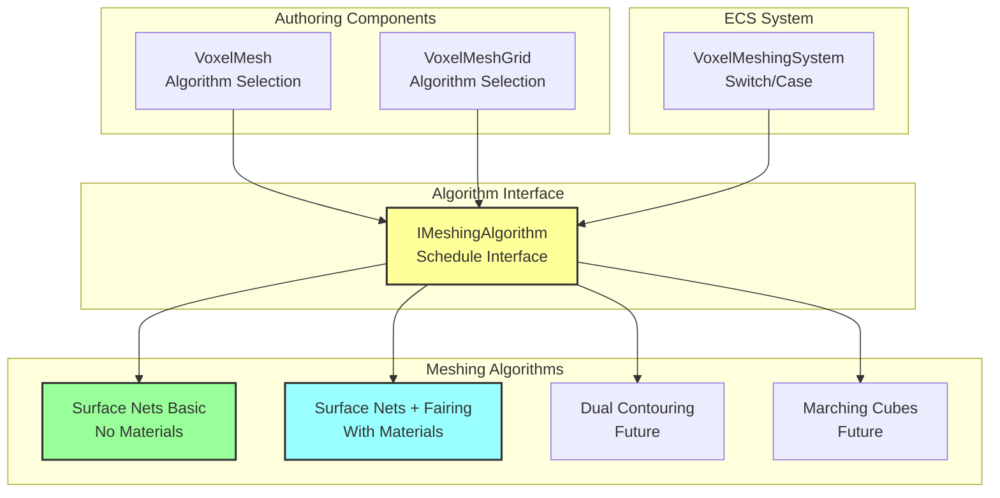
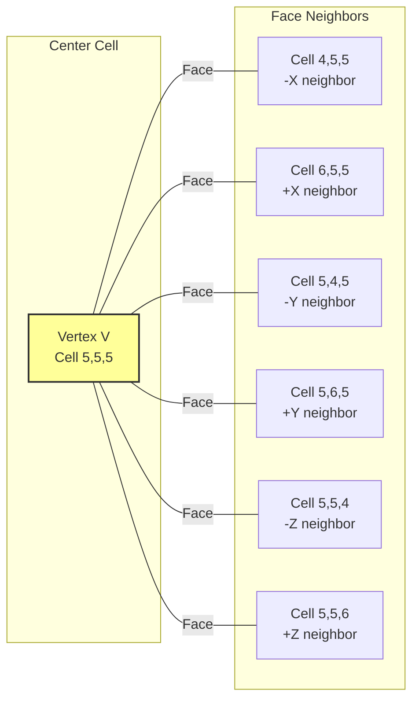
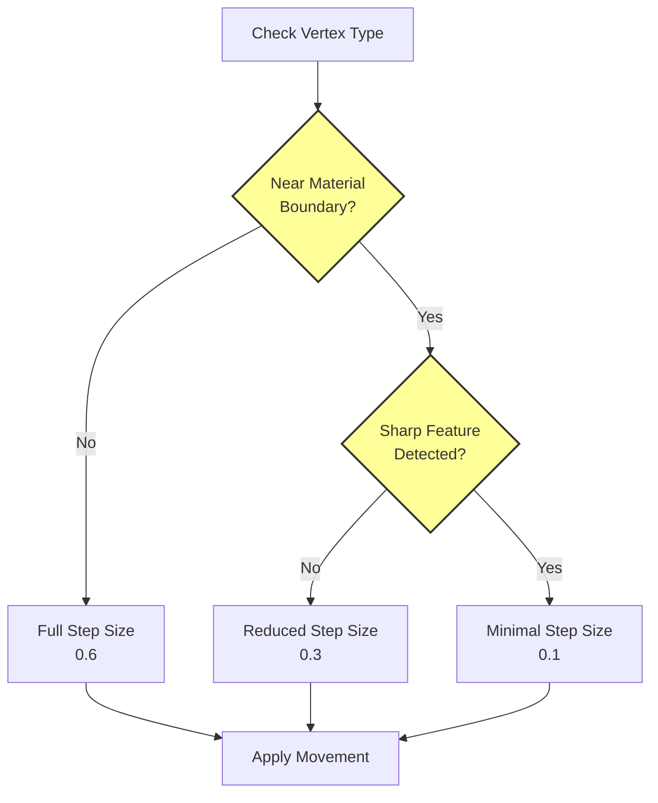
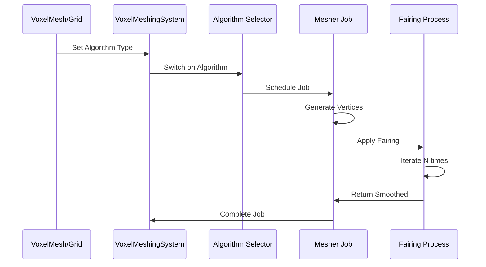
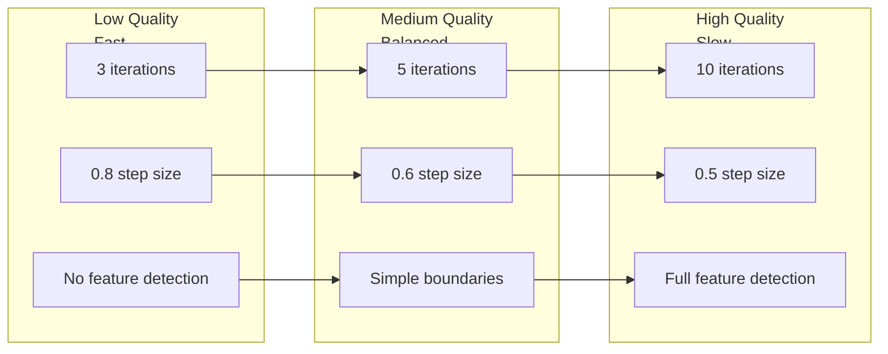

# Surface Fairing Implementation for Surface Nets

## Overview

Surface Fairing is a mesh smoothing technique specifically designed for Surface Nets that improves mesh quality while preserving important features like sharp boundaries and material interfaces. Based on the paper ["SurfaceNets for Multi-Label Segmentations with Preservation of Sharp Boundaries"](https://jcgt.org/published/0011/01/03/paper.pdf) (Journal of Computer Graphics Techniques, Vol. 11, No. 1, 2022), this document outlines a complete implementation plan.

## What is Surface Fairing?

Surface fairing is an iterative smoothing process that:
- Adjusts vertex positions to create smoother surfaces
- Constrains vertices to remain within their original voxel cells
- Uses only face-connected neighbors to preserve sharp features
- Maintains manifold topology throughout the process

### Key Benefits
1. **Smoother Surfaces**: Reduces jaggedness inherent in Surface Nets
2. **Feature Preservation**: Maintains sharp edges and corners
3. **Topology Safety**: Vertices stay within cells, preventing invalid meshes
4. **Material Boundary Respect**: Works well with multi-material meshes

## Algorithm from the Paper

The surface fairing algorithm from the JCGT paper follows this pseudocode:

```
iterate until an optimal smoothing is reached {
    for each vertex in vertex list {
        cell ← indexed from vertex (i, j, k)
        vertexPosition ← derived from vertex (i, j, k) and vertex offset
        localAverage ← avg. pos. of cell's face neighbor vertices (if present)
        vertexPosition ← vertexPosition + stepSize * (localAverage - vertexPosition)
        vertex offset ← update using vertex (i, j, k) and vertexPosition
        vertex offset ← constrain vertex offset to lie inside AllowedRange
    }
}
```

### Key Concepts

1. **Face Neighbors Only**: Unlike traditional Laplacian smoothing that uses all connected vertices, this uses only face-connected neighbors (6 possible in 3D grid)
2. **Cell Constraint**: Vertices must remain within their original voxel cell bounds
3. **Iterative Refinement**: Multiple passes allow gradual convergence
4. **Step Size Control**: Typically 0.5-0.7 for stability

## Architecture for Multiple Meshing Algorithms

### Algorithm Selection System



### Core Interfaces and Enums

```csharp
// Algorithm selection enum
public enum VoxelMeshingAlgorithm : byte
{
    SurfaceNetsBasic = 0,      // Current implementation, no materials
    SurfaceNetsFairing = 1,    // With fairing and materials
    DualContouring = 2,        // Future
    MarchingCubes = 3,         // Future
}

// Algorithm scheduler interface (similar to IProceduralVoxelGenerator)
public interface IMeshingAlgorithmScheduler
{
    JobHandle Schedule(
        in MeshingInputData input,
        in MeshingOutputData output,
        JobHandle inputDeps
    );
}

// Input/output data structures
[BurstCompile]
public struct MeshingInputData
{
    public NativeArray<sbyte> volume;
    public NativeArray<byte> materials;
    public float voxelSize;
    public int chunkSize;
    public bool recalculateNormals;
}

[BurstCompile]
public struct MeshingOutputData
{
    public NativeList<Vertex> vertices;
    public NativeList<int> indices;
    public UnsafePointer<MinMaxAABB> bounds;
}
```

### Algorithm Implementations

```csharp
// Basic Surface Nets (current implementation, preserved)
[BurstCompile]
public struct SurfaceNetsBasicScheduler : IMeshingAlgorithmScheduler
{
    public JobHandle Schedule(
        in MeshingInputData input,
        in MeshingOutputData output,
        JobHandle inputDeps)
    {
        var job = new MesherJobBasic
        {
            volume = input.volume,
            voxelSize = input.voxelSize,
            vertices = output.vertices,
            indices = output.indices,
            bounds = output.bounds,
            recalculateNormals = input.recalculateNormals
            // No materials, no edge table needed for collision-only
        };
        
        return job.Schedule(inputDeps);
    }
}

// Surface Nets with Fairing and Materials
[BurstCompile]
public struct SurfaceNetsFairingScheduler : IMeshingAlgorithmScheduler
{
    public int fairingIterations;
    public float fairingStepSize;
    public float cellMargin;
    
    public JobHandle Schedule(
        in MeshingInputData input,
        in MeshingOutputData output,
        JobHandle inputDeps)
    {
        var meshingJob = new MesherJobWithFairing
        {
            volume = input.volume,
            materials = input.materials,
            voxelSize = input.voxelSize,
            vertices = output.vertices,
            indices = output.indices,
            bounds = output.bounds,
            recalculateNormals = input.recalculateNormals,
            
            // Fairing parameters
            enableSurfaceFairing = true,
            fairingIterations = fairingIterations,
            fairingStepSize = fairingStepSize,
            cellMargin = cellMargin
        };
        
        return meshingJob.Schedule(inputDeps);
    }
}
```

### Integration with VoxelMeshingSystem

```csharp
// Modified VoxelMeshingSystem.cs
[BurstCompile]
public partial struct VoxelMeshingSystem : ISystem
{
    [BurstCompile]
    public void OnUpdate(ref SystemState state)
    {
        var ecb = GetSingleton<EndSimST>().CreateCommandBuffer(state.WorldUnmanaged);
        var concurrentMeshingJobs = state.Dependency;
        
        foreach (var (nativeVoxelMeshRef, algorithm, entity) in 
            Query<RefRW<NativeVoxelMesh>, VoxelMeshingAlgorithmComponent>()
                .WithAll<NeedsRemesh>()
                .WithEntityAccess())
        {
            ref var nvm = ref nativeVoxelMeshRef.ValueRW;
            
            // Prepare input/output data
            var input = new MeshingInputData
            {
                volume = nvm.volume.sdf,
                materials = nvm.volume.materials,
                voxelSize = nvm.voxelSize,
                chunkSize = CHUNK_SIZE,
                recalculateNormals = true
            };
            
            var output = new MeshingOutputData
            {
                vertices = nvm.meshing.vertices,
                indices = nvm.meshing.indices,
                bounds = nvm.meshing.bounds
            };
            
            // Schedule appropriate algorithm
            JobHandle meshingJob = algorithm.algorithm switch
            {
                VoxelMeshingAlgorithm.SurfaceNetsBasic => 
                    new SurfaceNetsBasicScheduler().Schedule(input, output, state.Dependency),
                    
                VoxelMeshingAlgorithm.SurfaceNetsFairing => 
                    new SurfaceNetsFairingScheduler
                    {
                        fairingIterations = algorithm.fairingIterations,
                        fairingStepSize = algorithm.fairingStepSize,
                        cellMargin = algorithm.cellMargin
                    }.Schedule(input, output, state.Dependency),
                    
                _ => throw new NotImplementedException($"Algorithm {algorithm.algorithm} not implemented")
            };
            
            concurrentMeshingJobs = JobHandle.CombineDependencies(meshingJob, concurrentMeshingJobs);
            
            ecb.SetComponentEnabled<NeedsRemesh>(entity, false);
            ecb.SetComponentEnabled<NeedsManagedMeshUpdate>(entity, true);
        }
        
        state.Dependency = concurrentMeshingJobs;
    }
}
```

### Authoring Component Updates

```csharp
// VoxelMesh.cs modifications
public sealed class VoxelMesh : MonoBehaviour
{
    // ... existing fields ...
    
    [Header("Meshing Algorithm")]
    [SerializeField]
    internal VoxelMeshingAlgorithm renderingAlgorithm = VoxelMeshingAlgorithm.SurfaceNetsFairing;
    
    [SerializeField]
    internal VoxelMeshingAlgorithm collisionAlgorithm = VoxelMeshingAlgorithm.SurfaceNetsBasic;
    
    [Header("Surface Fairing Settings")]
    [SerializeField]
    [Range(3, 10)]
    internal int fairingIterations = 5;
    
    [SerializeField]
    [Range(0.3f, 0.8f)]
    internal float fairingStepSize = 0.6f;
    
    [SerializeField]
    [Range(0.05f, 0.2f)]
    internal float cellMargin = 0.1f;
    
    void Awake()
    {
        this.CreateVoxelMeshEntity(
            gameObject.GetInstanceID(),
            transformAttachment ? transform : null,
            renderingAlgorithm,  // Pass algorithm selection
            collisionAlgorithm   // Future: separate collision mesh
        );
    }
}
```

## Implementation Plan

### Phase 0: Preserve Current Implementation

#### 0.1 Refactor Current MesherJob

Split the current `MesherJob.cs` into two versions:

1. **MesherJobBasic.cs** - Strip out all material-related code for collision-only meshes
   ```csharp
   // Simplified version without materials
   [BurstCompile]
   public struct MesherJobBasic : IJob
   {
       [ReadOnly] public NativeArray<sbyte> volume;
       [WriteOnly] public NativeList<Vertex> vertices;
       [WriteOnly] public NativeList<int> indices;
       public float voxelSize;
       public bool recalculateNormals;
       
       // No materials, no edge table, no color encoding
   }
   ```

2. **MesherJobWithMaterials.cs** - Current implementation as base for fairing version

#### 0.2 Create Algorithm Component

```csharp
[Serializable]
public struct VoxelMeshingAlgorithmComponent : IComponentData
{
    public VoxelMeshingAlgorithm algorithm;
    
    // Algorithm-specific parameters
    public int fairingIterations;
    public float fairingStepSize;
    public float cellMargin;
}
```

### Phase 1: Clean Up Current Implementation

#### 1.1 Remove Dual Contouring Artifacts

The current MesherJob.cs contains dual contouring concepts that don't belong in Surface Nets:

```csharp
// REMOVE: Material boundary plane fitting (lines 566-620)
// This attempts to fit planes to material boundaries - a DC concept

// REMOVE: Complex material gradient calculation (lines 886-914)
// Surface Nets should use simple corner-based material selection
```

#### 1.2 Simplified Material Assignment

Replace with straightforward corner sampling:

```csharp
Color32 GetVertexMaterialInfo(int* pos, float3 vertexOffset, byte* materialsPtr)
{
    // Sample materials at 8 corners
    byte cornerMaterials[8];
    int materialCounts[256] = {0};
    
    for (int i = 0; i < 8; i++)
    {
        int3 corner = int3(i & 1, (i >> 1) & 1, (i >> 2) & 1);
        cornerMaterials[i] = SampleMaterial(pos + corner);
        materialCounts[cornerMaterials[i]]++;
    }
    
    // Return two most common materials
    return GetTopTwoMaterials(materialCounts);
}
```

### Phase 2: Add Surface Fairing Infrastructure

#### 2.1 Extended Data Structures

```csharp
public struct MesherJobWithFairing : IJob
{
    // Existing fields...
    
    // Surface fairing data
    [WriteOnly] public NativeList<int3> vertexCellCoords;
    
    // Fairing parameters
    public bool enableSurfaceFairing;
    public int fairingIterations;      // Typically 3-10
    public float fairingStepSize;      // Typically 0.5-0.7
    public float cellMargin;           // Keep vertices away from cell edges (0.1)
}
```

#### 2.2 Neighbor Finding Algorithm



### Phase 3: Core Fairing Implementation

#### 3.1 Main Fairing Algorithm

```csharp
void ApplySurfaceFairing()
{
    int vertexCount = vertices.Length;
    var tempPositions = new NativeArray<float3>(vertexCount, Allocator.Temp);
    
    for (int iteration = 0; iteration < fairingIterations; iteration++)
    {
        // Copy current positions
        CopyVertexPositions(tempPositions);
        
        // Update each vertex
        for (int v = 0; v < vertexCount; v++)
        {
            UpdateVertexPosition(v, tempPositions);
        }
    }
    
    tempPositions.Dispose();
}

void UpdateVertexPosition(int vertexIndex, NativeArray<float3> tempPositions)
{
    int3 cellCoord = vertexCellCoords[vertexIndex];
    float3 currentPos = vertices[vertexIndex].position;
    
    // Calculate local average from face neighbors
    float3 localAverage = CalculateFaceNeighborAverage(vertexIndex, cellCoord, tempPositions);
    
    // Move toward average
    float3 newPos = currentPos + fairingStepSize * (localAverage - currentPos);
    
    // Constrain to cell with margin
    float3 cellMin = (float3)cellCoord * voxelSize + cellMargin;
    float3 cellMax = ((float3)cellCoord + 1.0f) * voxelSize - cellMargin;
    newPos = clamp(newPos, cellMin, cellMax);
    
    vertices[vertexIndex].position = newPos;
}
```

#### 3.2 Face Neighbor Detection

```csharp
float3 CalculateFaceNeighborAverage(int vertexIndex, int3 cellCoord, NativeArray<float3> positions)
{
    float3 sum = float3.zero;
    int count = 0;
    
    // Check all 6 face directions
    int3[] faceOffsets = {
        int3(-1, 0, 0), int3(1, 0, 0),  // ±X
        int3(0, -1, 0), int3(0, 1, 0),  // ±Y
        int3(0, 0, -1), int3(0, 0, 1)   // ±Z
    };
    
    for (int dir = 0; dir < 6; dir++)
    {
        int3 neighborCell = cellCoord + faceOffsets[dir];
        int neighborVertex = FindVertexInCell(neighborCell);
        
        if (neighborVertex >= 0)
        {
            sum += positions[neighborVertex];
            count++;
        }
    }
    
    return count > 0 ? sum / count : positions[vertexIndex];
}
```

### Phase 4: Sharp Boundary Preservation

Based on the paper's approach for multi-label segmentations:

#### 4.1 Material Boundary Detection

```csharp
bool IsNearMaterialBoundary(int vertexIndex, float threshold = 0.1f)
{
    int3 cellCoord = vertexCellCoords[vertexIndex];
    byte centerMaterial = GetMaterialAtCell(cellCoord);
    
    // Check if any face neighbor has different material
    for (int dir = 0; dir < 6; dir++)
    {
        int3 neighborCell = cellCoord + faceDirections[dir];
        byte neighborMaterial = GetMaterialAtCell(neighborCell);
        
        if (neighborMaterial != centerMaterial)
            return true;
    }
    
    return false;
}
```

#### 4.2 Adaptive Step Size



```csharp
float GetAdaptiveStepSize(int vertexIndex)
{
    float baseStepSize = fairingStepSize;
    
    // Reduce near material boundaries
    if (IsNearMaterialBoundary(vertexIndex))
    {
        baseStepSize *= 0.5f;
    }
    
    // Further reduce at sharp features
    if (HasSharpFeature(vertexIndex))
    {
        baseStepSize *= 0.3f;
    }
    
    return baseStepSize;
}
```

#### 4.3 Feature Detection

```csharp
bool HasSharpFeature(int vertexIndex)
{
    // Check normal deviation among face neighbors
    float3 centerNormal = vertices[vertexIndex].normal;
    float maxDot = 1.0f;
    
    foreach (int neighbor in GetFaceNeighbors(vertexIndex))
    {
        float3 neighborNormal = vertices[neighbor].normal;
        float dotProduct = dot(centerNormal, neighborNormal);
        maxDot = min(maxDot, dotProduct);
    }
    
    // Sharp feature if normals differ significantly
    return maxDot < 0.7f; // ~45 degree threshold
}
```

### Phase 5: Integration and Optimization

#### 5.1 Integration Points



#### 5.2 Performance Optimizations

```csharp
// Cache neighbor relationships
struct NeighborCache
{
    public NativeArray<int> neighbors; // 6 * vertexCount
    
    public void Build(NativeList<int3> cellCoords)
    {
        // Pre-compute all neighbor relationships
        // Avoid repeated searches during iterations
    }
}

// Parallel fairing updates
[BurstCompile]
struct ParallelFairingJob : IJobParallelFor
{
    [ReadOnly] public NativeArray<float3> sourcePositions;
    [ReadOnly] public NativeArray<int> neighborCache;
    [WriteOnly] public NativeArray<float3> targetPositions;
    
    public void Execute(int index)
    {
        // Update single vertex using cached neighbors
    }
}
```

## Configuration Guidelines

### Recommended Parameters

| Parameter       | Range    | Default | Notes                                |
| --------------- | -------- | ------- | ------------------------------------ |
| Iterations      | 3-10     | 5       | More iterations = smoother           |
| Step Size       | 0.3-0.8  | 0.6     | Lower = more stable                  |
| Cell Margin     | 0.05-0.2 | 0.1     | Prevents edge artifacts              |
| Sharp Threshold | 0.5-0.9  | 0.7     | Cosine threshold for sharp detection |

### Quality vs Performance Tradeoffs



### Algorithm Selection Guidelines

| Use Case               | Algorithm          | Rationale                 |
| ---------------------- | ------------------ | ------------------------- |
| Collision Only         | SurfaceNetsBasic   | Fast, no materials needed |
| Visual Mesh (Low LOD)  | SurfaceNetsBasic   | Performance over quality  |
| Visual Mesh (High LOD) | SurfaceNetsFairing | Quality for close viewing |
| Hero Objects           | SurfaceNetsFairing | Maximum quality           |
| Future: Sharp Features | DualContouring     | Preserves exact edges     |

## Testing and Validation

### Test Cases

1. **Algorithm Switching**
   - Verify each algorithm produces valid meshes
   - Test transitions between algorithms

2. **Single Material Smooth Surface**
   - Verify smoothing improves triangle quality
   - Check vertices stay within cells

3. **Material Boundary Preservation**
   - Ensure boundaries remain distinct
   - Verify no material bleeding

4. **Sharp Edge Preservation**
   - Test cube with sharp corners
   - Verify edges remain crisp

5. **Performance Benchmarks**
   - Target: < 2ms additional time per chunk for fairing
   - Memory: Minimal additional allocation

### Visual Debugging

```csharp
// Debug visualization options
public enum FairingDebugMode
{
    None,
    ShowCellBounds,      // Draw cell boundaries
    ShowNeighborLinks,   // Draw neighbor connections
    ShowMovementVectors, // Show fairing displacements
    ColorByIterations,   // Heat map of movement
    ShowAlgorithmUsed    // Color by algorithm type
}
```

## Future Extensions

### Additional Algorithms

```csharp
public enum VoxelMeshingAlgorithm : byte
{
    // Current
    SurfaceNetsBasic = 0,
    SurfaceNetsFairing = 1,
    
    // Future additions
    DualContouring = 2,
    DualContouringManifold = 3,
    MarchingCubes = 4,
    MarchingCubes33 = 5,
    MarchingTetrahedra = 6,
    ExtendedMarchingCubes = 7,
    AdaptiveSurfaceNets = 8
}
```

### Per-LOD Algorithm Selection

```csharp
[Serializable]
public struct LODAlgorithmMapping
{
    public int lodLevel;
    public VoxelMeshingAlgorithm algorithm;
    public MeshingParameters parameters;
}
```

## Conclusion

This implementation plan provides:

1. **Preserved Compatibility**: Current Surface Nets implementation remains available
2. **Algorithm Flexibility**: Per-object algorithm selection
3. **Surface Fairing**: High-quality mesh smoothing with feature preservation
4. **Extensible Architecture**: Easy to add new algorithms
5. **Performance Options**: Choose speed vs quality as needed

The architecture respects Unity's ECS patterns while providing the flexibility needed for different use cases, from fast collision meshes to high-quality rendered surfaces.