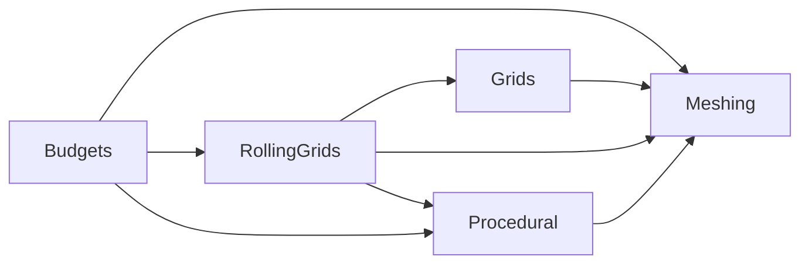

## Domain-based refactor (v1)

Date: 2025-09-06
Scope: `Packages/com.voxelmeshframework/**`

### Summary
Refactor by separating into five logical domains with clear responsibilities and minimal, testable helpers:

- Procedural
- Meshing
- Grids
- Budgets
- Rolling Grids

Keep behavior identical. Prefer small static helpers and ≤200 LOC per file. `ISystem`/MonoBehaviours remain thin orchestrators; computation and scheduling details move into pure/static helpers inside their domain.

### Goals
- Increase readability and modularity per domain
- Minimize cross-domain coupling; depend only inward on abstractions
- Reuse shared logic via small static classes; avoid duplication
- Preserve public surface; no breaking changes intended

### Domain boundaries and responsibilities

- Procedural
  - Responsibilities: authoring-driven or programmatic voxel content generation; defers to jobs and fences.
  - Includes: `ProceduralVoxelGenerationSystem`, `PopulateWithProceduralVoxelGenerator`, `NeedsProceduralUpdate`, generators (e.g., Simple Noise, Hemisphere).
  - Provides: `ProceduralScheduling` static for job submission + fence updates.

- Meshing
  - Responsibilities: voxel → mesh conversion, optional fairing, managed upload/attach.
  - Includes: `VoxelMeshingSystem`, `ManagedVoxelMeshingSystem`, `MeshingScheduling`, `NaiveSurfaceNets*`, `SharedStaticMeshingResources`, `ManagedMeshCombine`.
  - Provides: `MeshAttachers` (MeshFilter/Collider), `ManagedMeshApply`, `MeshingInputData`/`OutputData` helpers.

- Grids
  - Responsibilities: grid/chunk topology and lifecycle, allocation/instantiation, counters/progress.
  - Includes: `NativeVoxelGrid`, `NativeVoxelChunk`, `GridChunkAllocationSystem`, `GridChunkHybridInstantiationSystem`, `GridMeshingProgress`, `NativeGridMeshingCounters`, `NeedsChunkAllocation`, `ChunkHybridReady`, `ChunkPrefabSettings`.
  - Provides: `GridMath`, `ChunkEntityFactory`, `GridProgress` statics.

- Budgets (NEW)
  - Responsibilities: centralize per-frame budgets and throttling for generation/meshing/apply, policy configuration.
  - Includes: `MeshingBudget` usage, `MeshSchedulingPolicy` (from settings), `BudgetAllocatorSystem` (NEW), `BudgetAccounting`/`FrameBudget` statics (NEW).
  - Provides: `BudgetTokens` API (static) to gate costly steps (e.g., max meshes per frame, uploads per frame).

- Rolling Grids (NEW domain)
  - Responsibilities: rolling-grid movement semantics, batching, commit signaling and anchor updates.
  - Includes (to move here): `RollingGridConfig`, `RollingGridMoveRequest`, `RollingGridBatchActive`, `RollingGridCommitEvent`, `RollingGridState`, `RollingGridOrchestratorSystem`.
  - Provides: `RollingMoveGuards`, `RollingStep`, `SlabSelection`, `SlabScheduling` statics.

### Proposed folder and namespace layout

```
Packages/com.voxelmeshframework/Core/
  Procedural/
    Systems/, Tags/, Generators/, Scheduling/
  Meshing/
    Systems/, Algorithms/, Fairing/, Utilities/
  Grids/
    Systems/, Components/, Utilities/
  Budgets/                # NEW
    Systems/, Utilities/
  RollingGrids/           # NEW
    Systems/, Components/, Utilities/
```

Namespaces remain under `Voxels.Core.<Domain>[.<Subarea>]` (e.g., `Voxels.Core.RollingGrids.Systems`).

### File mapping (high level)

- Move to RollingGrids:
  - `Core/Grids/RollingGridConfig.cs` → `Core/RollingGrids/Components/RollingGridConfig.cs`
  - `Core/Grids/RollingGridMoveRequest.cs` → `Core/RollingGrids/Components/RollingGridMoveRequest.cs`
  - `Core/Grids/RollingGridBatchActive.cs` → `Core/RollingGrids/Components/RollingGridBatchActive.cs`
  - `Core/Grids/RollingGridCommitEvent.cs` → `Core/RollingGrids/Components/RollingGridCommitEvent.cs`
  - `Core/Grids/RollingGridState.cs` → `Core/RollingGrids/Components/RollingGridState.cs`
  - `Core/Meshing/Systems/RollingGridOrchestratorSystem.cs` → `Core/RollingGrids/Systems/RollingGridOrchestratorSystem.cs`

- Extract to Budgets (initially wrappers; optional full migration later):
  - `NativeVoxelGrid.MeshingBudget` usage → helpers in `Core/Budgets/Utilities/BudgetAccounting.cs`
  - `VoxelProjectSettings.meshSchedulingPolicy` → read via `Core/Budgets/Utilities/BudgetPolicy.cs`
  - Add `Core/Budgets/Systems/BudgetAllocatorSystem.cs` to hand out budget tokens per frame.

- Grids keep:
  - `GridChunkAllocationSystem`, `GridChunkHybridInstantiationSystem`, `GridMeshingProgress`, `NativeGridMeshingCounters`, `NativeVoxelGrid`, `NativeVoxelChunk`, `NeedsChunkAllocation`, `ChunkPrefabSettings`, `ChunkHybridReady`.
  - New helpers: `GridMath.cs`, `ChunkEntityFactory.cs`, `GridProgress.cs`.

- Meshing keep:
  - `VoxelMeshingSystem`, `ManagedVoxelMeshingSystem`, `MeshingScheduling`, `NaiveSurfaceNets*`, `SharedStaticMeshingResources`, `ManagedMeshCombine`.
  - New helpers: `ManagedMeshApply.cs`, `MeshAttachers.cs` (split by filter/collider), `MeshingGuards.cs`.

- Procedural keep:
  - `ProceduralVoxelGenerationSystem`, tags/components, generators.
  - New helper: `ProceduralScheduling.cs`.

### Cross-domain dependencies



Rules:
- Domains depend on Meshing for mesh creation; Meshing is pure/static aside from Unity jobs.
- Budgets gate costly operations across domains using `BudgetTokens`.
- Rolling Grids orchestrates steps but uses Procedural/Meshing statics; Grids provides topology and entity sets.

### Implementation plan (phased)

1) Create domain folders + namespaces and add empty static helper shells
   - Add `Budgets/` and `RollingGrids/` with `Utilities/` and `Systems/` folders.
   - Introduce `VoxelFences` façade (Concurrency) for brevity at call-sites.

2) Move Rolling Grid components and system
   - Relocate files listed above; update namespaces to `Voxels.Core.RollingGrids.*`.
   - Update references/usings in tests and systems.
   - Extract `RollingMoveGuards`, `RollingStep`, `SlabSelection`, `SlabScheduling` statics; keep `OnUpdate` thin.

3) Introduce Budgets domain
   - Add `BudgetAllocatorSystem` (per-frame token issue, respecting `MeshSchedulingPolicy`).
   - Add `BudgetAccounting` statics and integrate in `VoxelMeshingSystem` and `ManagedVoxelMeshingSystem` (non-breaking: early-out when no tokens).
   - Keep `NativeVoxelGrid.MeshingBudget` component as-is; read/write via accounting helpers.

4) Grids/Meshing/Procedural helper extraction
   - Grids: `GridMath`, `ChunkEntityFactory`, `GridProgress`.
   - Meshing: `ManagedMeshApply`, `MeshAttachers`, optional `MeshingGuards`.
   - Procedural: `ProceduralScheduling` for fence + signal toggles.

5) Cleanup and docs
   - Ensure each file ≤200 LOC; split with partials where needed (e.g., `VoxelEntityBridge`).
   - Update docs and diagrams; keep public API stable.

### Expected outcomes
- Clear domain ownership and thin orchestration layers
- Easier navigation; smaller, testable files
- Shared logic consolidated in static helpers; no duplication

### Considerations
- Breaking changes: avoid renames; only namespace moves. Update imports accordingly.
- Performance: maintain `SharedStatic` usage; avoid extra allocations in helper boundaries.
- Assemblies: optional future split into per-domain `.asmdef`s; initial pass keeps `Voxels.Core` to reduce churn.

### Risks and mitigations
- Namespace moves can be noisy: tackle per domain per PR; rely on IDE-assisted refactors.
- Budgets integration must not stall pipelines: start with no-op tokens for equivalence; enable real throttling behind a feature flag.

### Rollback plan
- Each phase is an extraction/move. Revert the specific PR if regressions appear; original logic remains available in history.


