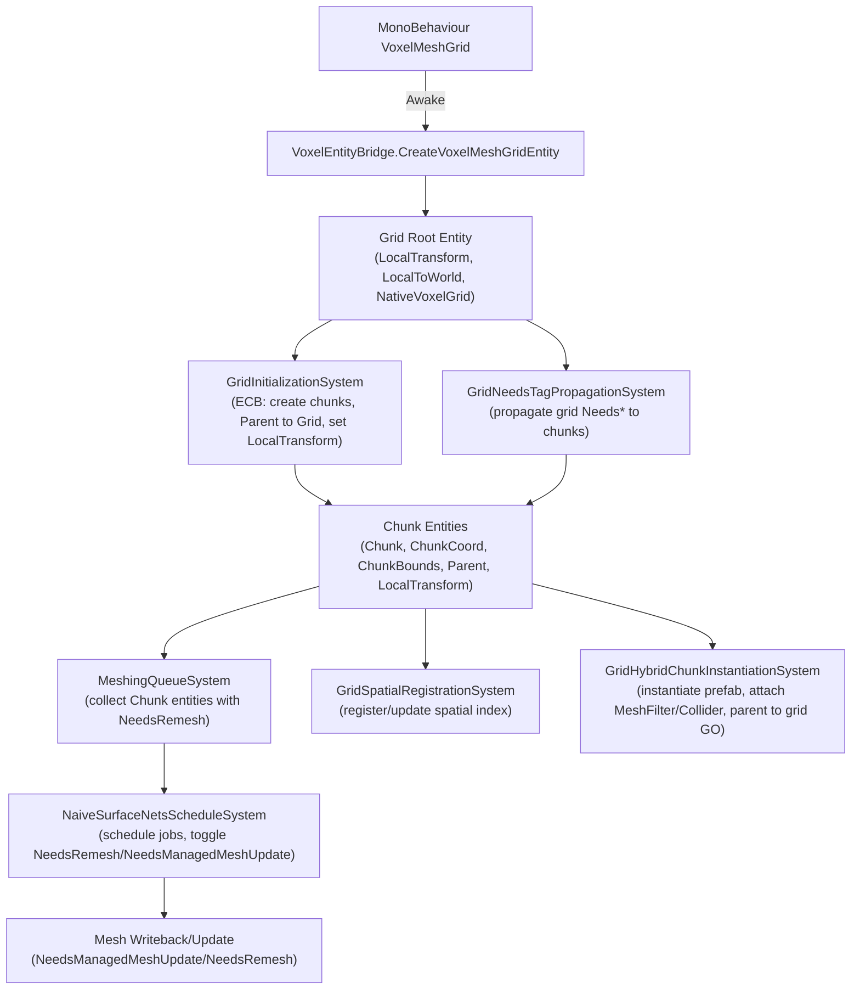

## Fixed-size Grid Support (Phase 1) — Implementation Plan

### Context
- Project uses runtime GameObject→Entity mapping via `VoxelEntityBridge` (no SubScene baking).
- Surface Nets implementation operates on 32×32×32 voxel volumes with a 1-voxel apron, yielding an effective 30×30×30 interior. Positioning chunks at 30-voxel increments prevents cracks across chunk borders (see `apron.md`).
- We will add a non-resizable, transformable grid. Chunks are parented to the grid root entity so `TransformSystemGroup` maintains `LocalToWorld` automatically.
- Background processing: no sync points; jobs are chained with deferred job arrays and structural changes are recorded via ECBs (never from inside jobs). Jobs are only scheduled from the managing thread.
  - Per‑mesh job fencing is provided by `VoxelJobFenceRegistry` managed by `VoxelJobFenceRegistrySystem`; all writers/readers must chain to and update the entity’s fence.

### Manual Check
- Packages: Entities 1.3.14, Collections 2.5.7, Burst 1.8.24, Mathematics 1.3.2
- Topics reviewed: LocalTransform/Parent/Child and `TransformSystemGroup`; structural changes via `EntityCommandBuffer`; job scheduling with IJobEntity/IJobChunk; deferred job arrays; change filtering.
- Key guidance to apply:
  - Parent chunks to a grid root with `LocalTransform`; `LocalToWorld` is computed by transform systems.
  - Perform structural changes (create/destroy/add/remove components) via ECB/ParallelWriter; never from jobs directly.
  - Do not schedule jobs from jobs; chain with `JobHandle` and `AsDeferredJobArray()`; avoid `.Complete()` until required.
  - Use change filters/versioning to skip unchanged data; call `JobHandle.ScheduleBatchedJobs()` after batched schedules.

### Goals (Phase 1)
- Non-resizable, transformable grid root entity created at runtime through `VoxelEntityBridge`.
- Spawn a fixed set of chunk entities parented to the grid and positioned at 30-voxel increments multiplied by `voxelSize`.
- Meshing pipeline that consumes chunk work in the background with no sync points (deferred job arrays + ECB). This must be already implemented, as long as Chunks receive a valid NativeVoxelMesh.Request component, allocated by VoxelMeshAllocationSystem.
- Extensible policy layer for grid spacing/apron rules (Surface Nets policy now; future algorithms later).

### Use Cases: Movable Voxel Volumes
- Fixed-size grids represent movable voxel volumes (e.g., boss barriers/shields, destructible platforms, moving hazards).
- They are designed to be attached to or hosted by a GameObject and can be translated/rotated as a single gameplay element.
- These fixed-size grids remain a first-class feature even after rolling grids are added.

### High-level Architecture


### Components and Tags (new)
- `Chunk` (tag)
- `ChunkCoord` (IComponentData): `int3 Value`
- `ChunkBounds` (IComponentData): `MinMaxAABB LocalBounds`
- Reuse existing enableable tags for meshing lifecycle across objects, grids, and chunks:
  - `NeedsRemesh` (enableable)
  - `NeedsManagedMeshUpdate` (enableable)
  - `NeedsSpatialUpdate` (enableable)
- `ChunkMeshingInFlight` (tag) — optional; may be replaced by enable/disable patterns
- `SurfaceNetsGridPolicy` (IComponentData) or constants to encode:
  - `ChunkSize = 32`
  - `EffectiveChunkSize = 30`
  - `Apron = 1`

- Grid allocation and cleanup:
  - `NeedsChunkAllocation` (IComponentData, enableable) — on grid root; indicates chunks must be (re)allocated
  - `GridChunksCleanup` (ICleanupComponentData) — on grid root; used to run cleanup logic when grid is destroyed
  - `LinkedEntityGroup` (DynamicBuffer) — on grid root; all created chunk entities are appended so destruction of the grid also destroys its chunks automatically

- Hybrid chunk instantiation:
  - `ChunkPrefabSettings` (IComponentData, managed refs): references to a chunk GameObject prefab and default `Material`
  - `ChunkHybridReady` (tag): marks chunks that have their hybrid GO instantiated and attached

Example skeletons (file/class names must match, single top-level class per file):
```csharp
// Chunk.cs
using Unity.Entities;
public struct Chunk : IComponentData {}

// ChunkCoord.cs
using Unity.Entities; using Unity.Mathematics;
public struct ChunkCoord : IComponentData { public int3 Value; }

// ChunkBounds.cs
using Unity.Entities; using Unity.Mathematics.Geometry;
public struct ChunkBounds : IComponentData { public MinMaxAABB LocalBounds; }
```

### Needs* Tag Propagation

- Purpose: One-shot broadcast from the grid root to all owned chunks for enableable lifecycle tags.
- Tags propagated from grid → chunks:
  - `NeedsRemesh`
  - `NeedsManagedMeshUpdate`
  - `NeedsSpatialUpdate`
- Tags not propagated:
  - `NeedsChunkAllocation` (grid-only lifecycle)
  - `ChunkMeshingInFlight` (chunk-only lifecycle)
- Semantics:
  - Enabling an applicable `Needs*` tag on the grid triggers a fanout that enables the same tag on every child chunk (idempotent).
  - After fanout is enqueued via ECB, the grid tag is cleared (consumed) to avoid re-queuing.
  - New chunks created later inherit any currently enabled grid tags at creation time (see GridChunkAllocationSystem).
- Implementation notes:
  - Iterate children via `LinkedEntityGroup`; skip element 0 (the root).
  - Use `WithChangeFilter` on the grid tags to only process on state changes.
  - Use `ECB.ParallelWriter` to enable tags on children; no fences are mutated.

### Systems (new)
All systems follow the Jobs scheduling and HPC#/Burst rules:
- Schedule jobs from the managing thread only, never inside jobs.
- Use `[BurstCompile]` on hot paths; pass only blittable data; avoid `UnityEngine.*` in Burst paths.
- Chain dependencies with `JobHandle` and `JobHandle.CombineDependencies`.
- Use ECB/ParallelWriter for structural changes and play back after jobs.
 - Respect per‑entity fences via `VoxelJobFenceRegistry.Tail(e)` and `VoxelJobFenceRegistry.Update(e, handle)`; complete fences at managed apply boundaries.

1) GridChunkAllocationSystem
- Purpose: Create and place chunk entities for each grid root (`NativeVoxelGrid`).
- Query: `NativeVoxelGrid` roots with `NeedsChunkAllocation` enabled (or lacking chunk children/marker as a fallback).
- For each grid root:
  - Compute grid dimensions from `bounds` and `voxelSize` using `EffectiveChunkSize = 30` (apron-aware).
  - Create chunks via `EntityCommandBuffer.ParallelWriter`.
  - Set `Parent { Value = grid }` + `LocalTransform` for chunk local placement:
    - `Position = (gridLocalOrigin + (coord * 30) * voxelSize)`; `Rotation = identity`; `Scale = 1`.
  - Add `Chunk`, `ChunkCoord`, `ChunkBounds` (local bounds in grid space), and `ChunkMeshingRequest`.
  - Ensure the grid root has a `LinkedEntityGroup` buffer and append each created chunk entity to it.
  - Enable any applicable `Needs*` currently enabled on the grid (`NeedsRemesh`/`NeedsManagedMeshUpdate`/`NeedsSpatialUpdate`) so new chunks inherit broadcast state.
  - Disable `NeedsChunkAllocation` on success.
- Notes: No baking; called at runtime after `VoxelEntityBridge` creates the grid root entity.

2) MeshingQueueSystem
- Purpose: Build a deferred work list of entities requiring meshing, unified across objects, grids, and chunks.
- Query: chunk entities (`WithAll<Chunk>`) with `NeedsRemesh` enabled; optionally filter by visibility/dirty flags.
- Output: `NativeList<Entity>` exposed as `AsDeferredJobArray()` to downstream stages.
- No sync points; only dependency chaining.
 - Fencing: queueing does not mutate fences; downstream schedulers will read/update via `VoxelJobFenceRegistry`.

3) NaiveSurfaceNetsScheduleSystem
- Purpose: Schedule meshing jobs for enqueued chunks.
- Input: Deferred array from `MeshingQueueSystem`.
- For each chunk:
  - Prepare/access per-chunk volume/material buffers (with apron), using policy constants (`32`/`30`).
  - Read pre‑dependency from `VoxelJobFenceRegistry.Tail(chunk)`.
  - Schedule `NaiveSurfaceNets` IJob (Burst) with `voxelSize` using that dependency; assert `CHUNK_SIZE == 32`.
  - Immediately `VoxelJobFenceRegistry.Update(chunk, scheduledHandle)` to extend the fence.
  - Record tag updates with `ECB.ParallelWriter`:
    - Disable `NeedsRemesh` on success
    - Enable `NeedsManagedMeshUpdate` for renderer upload
    - Optionally toggle `ChunkMeshingInFlight` around execution
- On completion (ECB playback): attach/refresh mesh data components (align with existing `NativeVoxelMesh` + `NeedsManagedMeshUpdate`/`NeedsRemesh`).

4) GridSpatialRegistrationSystem
- Purpose: Register/update chunk entries in the existing spatial system.
- Input: `ChunkBounds.LocalBounds` stored in grid space + grid's `LocalToWorld`.
- Fetch grid `LocalToWorld` once per update, then compute each chunk world AABB by transforming its grid-local AABB with the single grid matrix (avoid per-chunk transform lookups).
- Mark/clear `NeedsSpatialUpdate` appropriately (reuse existing patterns).
 - Fencing: reading transform/AABB components is main‑thread; does not alter per‑mesh fences.

5) GridChunksCleanupSystem
- Purpose: Ensure cleanup logic runs when a grid is destroyed while using `LinkedEntityGroup` for chunk destruction.
- Query: `GridChunksCleanup` (ICleanupComponentData) on grid root; this component survives entity destruction for one frame to allow cleanup.
- Behavior:
  - Rely on `LinkedEntityGroup` to have destroyed all linked chunk entities automatically.
  - Dispose/free any grid-level native allocations or pooled resources (if any) here.
  - Remove `GridChunksCleanup` when finished.

6) GridHybridChunkInstantiationSystem (Managed)
- Purpose: Instantiate a hybrid GameObject per chunk using a grid-provided prefab, wire MeshFilter/Renderer/Collider, and link to ECS.
- Inputs:
  - Grid root with `ChunkPrefabSettings` (prefab `GameObject`, default `Material`)
  - Chunks without `ChunkHybridReady`
- Behavior:
  - Instantiate prefab GameObject for each chunk.
  - Parent the chunk GameObject under the grid host GameObject.
  - Assign or fetch `MeshFilter` and set its `sharedMaterial` on `MeshRenderer` (if present).
  - Assign/create `MeshCollider`.
  - Set attachments on the chunk entity:
    - `EntityMeshFilterAttachment { attachTo = meshFilter }`
    - `EntityMeshColliderAttachment { attachTo = meshCollider }`
    - `EntityGameObjectTransformAttachment { attachTo = chunkGO.transform }`
  - Add `ChunkHybridReady` tag to prevent re-instantiation.
  - Before applying mesh/collider updates on the main thread, call `VoxelJobFenceRegistry.CompleteAndReset(chunk)` to ensure all scheduled work for that chunk has finished.
- Notes:
  - Rely on Unity’s Transform parenting to propagate the grid transform to chunk GOs (no ECS→GO transform sync needed).
  - On destruction, `LinkedEntityGroup` handles chunk entity lifetime; the managed system should destroy corresponding GOs if needed (or rely on parent GO destruction).

7) GridNeedsTagPropagationSystem
- Purpose: Mirror grid-level `Needs*` tags to all owned chunk entities and consume the grid tags.
- Query:
  - Grids with `LinkedEntityGroup` and any of `NeedsRemesh`, `NeedsManagedMeshUpdate`, or `NeedsSpatialUpdate` changed/enabled.
- Behavior:
  - For each matching grid, iterate its `LinkedEntityGroup` (skip index 0/root) and enable the corresponding tag on each child that has `Chunk`.
  - Clear the processed tag on the grid via `ECB.SetComponentEnabled<T>(grid, false)` to consume the broadcast.
  - Use `ECB.ParallelWriter` for scalability; this system does not read or update per-chunk fences.
- Ordering:
  - Run after `GridChunkAllocationSystem` so newly created chunks are included in the fanout.
  - Run before `MeshingQueueSystem` so propagated `NeedsRemesh` states are visible to the queue builder.
- Conceptual snippet:
```csharp
// For each grid root 'g' with LinkedEntityGroup 'leg'
if (SystemAPI.IsComponentEnabled<NeedsRemesh>(g))
{
    for (int i = 1; i < leg.Length; i++)
    {
        var e = leg[i].Value;
        if (SystemAPI.HasComponent<Chunk>(e)) ecb.SetComponentEnabled<NeedsRemesh>(e, true);
    }
    ecb.SetComponentEnabled<NeedsRemesh>(g, false); // consume
}
```

### Placement and Transforms
- Grid root entity has `LocalTransform` mirrored from `VoxelMeshGrid` authoring (via `VoxelEntityBridge`).
- Chunks are parented to the grid entity (`Parent`) and hold their own `LocalTransform` with positions stepping by `effectiveChunkSize * voxelSize` (30-increments).
- `TransformSystemGroup` updates `LocalToWorld` for both grid and chunks.

### AABB Transformation Optimization
- Store each `ChunkBounds.LocalBounds` in grid-local space (min/max in grid coordinates).
- Acquire grid `LocalToWorld` once and transform all chunk AABBs using the built-in API:
  - Prefer `Unity.Mathematics.Geometry.Math.Transform(float4x4, MinMaxAABB)`
```csharp
// World AABB from grid-local AABB using Unity's built-in transform
var world = Unity.Mathematics.Geometry.Math.Transform(gridL2W, local);
```

### Lifetime, Ownership, and Cleanup
- Ownership: The grid root owns its chunks via `LinkedEntityGroup`.
- Destruction: Destroying the grid root destroys all linked chunk entities automatically.
- Cleanup: Use `GridChunksCleanup` (ICleanupComponentData) on the grid root to run finalizers. Chunk-level native memory should use their own allocation/cleanup patterns (e.g., allocation via request + disposal when request removed, or their own `ICleanupComponentData`).

### Scheduling and Sync-free Chaining
- Use `IJobEntity`/`IJobChunk` to iterate over chunk sets.
- Aggregate chunk work into `NativeList<Entity>` and pass down via `AsDeferredJobArray()` to avoid reading list lengths on the main thread.
- Record all structural changes in ECB/ParallelWriter; play back after dependent jobs complete.
- Call `JobHandle.ScheduleBatchedJobs()` after batching schedules; avoid `.Complete()` except where results are required at boundaries.
 - Use `VoxelJobFenceRegistry` to read the current fence for each entity before scheduling and to update it with the returned job handle; only complete at managed apply boundaries.
 - Propagation uses only ECB writes; it does not participate in per-entity job fences.

### Burst/HPC# Constraints (hot paths)
- Entry points are static, `[BurstCompile]`, unmanaged-only parameters.
- No managed allocations, exceptions, or `UnityEngine` calls inside Burst jobs.
- Use `Unity.Collections` containers and `Unity.Mathematics` types.

### Data and Memory Notes
- Per-chunk volume/material buffers must be provided by the existing procedural/runtime data providers. Phase 1 assumes in-memory generation is available when needed. Disk streaming is deferred to rolling grids (later phase).
- Honor apron rules: allocate/access `(N+2)^3` samples for `N=32` for crack-free meshing.

### Coding Conventions to Observe
- C# file/class naming: filename equals the primary top-level class; keep one top-level class per file when possible.
- Prefer `Unity.Mathematics` types (`float3`, `quaternion`, etc.) and `using static Unity.Mathematics.math;` in core logic. Convert to `UnityEngine` types only at adapter edges.
- Jobs scheduling: schedule from systems only; never schedule inside job `Execute`.

### Example Snippets
Chunk local placement (conceptual):
```csharp
// In GridInitializationSystem (ECB path)
var localPos = (gridLocalOrigin + (coord * 30) * voxelSize);
ecb.SetComponent(chunk, new Unity.Transforms.LocalTransform {
    Position = localPos,
    Rotation = Unity.Mathematics.quaternion.identity,
    Scale = 1f,
});
ecb.AddComponent(chunk, new Parent { Value = grid });
```

Deferred work list pattern:
```csharp
// Build work list
// var list = new NativeList<Entity>(Allocator.TempJob);
// ... fill in parallel ...
var deferred = list.AsDeferredJobArray();
// Schedule downstream jobs that consume 'deferred' without reading its length on the main thread.
```

Fenced scheduling (conceptual):
```csharp
// For each chunk entity 'e' to mesh
var pre = Voxels.Core.Concurrency.VoxelJobFenceRegistry.Tail(e);
var handle = new NaiveSurfaceNetsJob { /*...*/ }.Schedule(pre);
Voxels.Core.Concurrency.VoxelJobFenceRegistry.Update(e, handle);
ecb.SetComponentEnabled<NeedsRemesh>(e, false);
ecb.SetComponentEnabled<NeedsManagedMeshUpdate>(e, true);
JobHandle.ScheduleBatchedJobs();
```

### Expected Outcomes
- Seam-free tiling by aligning chunk origins to 30-voxel increments (apron-aware).
- Grid-level transform moves/rotates/scales all chunks via transform systems.
- Meshing pipeline runs in the background without sync points; structural changes are ECB-driven.
- Clear extension points for other meshing algorithms and LOD edge-blending in future phases.

### Considerations & Risks
- Non-uniform scaling: out of scope for phase 1 (would require `PostTransformMatrix`).
- Large grids: ensure reasonable batch sizes; consider culling/priority for meshing requests.
- Memory pressure: apron increases per-chunk memory; consider pooling/reuse.

### Testing Plan
- Visual seam tests across chunk borders with varying grid transforms.
- Stress tests on meshing throughput with many chunks; verify no main-thread stalls.
- Spatial registration correctness: bounds updates and culling behavior.
- Propagation correctness: enabling grid-level `NeedsRemesh`/`NeedsManagedMeshUpdate`/`NeedsSpatialUpdate` propagates to all child chunks and clears on the grid; newly created chunks inherit active tags.

#### Testing Implementation Plan

- EditMode unit tests (Editor):
  - Grid entity creation (bridge)
    - Grid has `LocalToWorld`, `LocalTransform`, `NativeVoxelGrid`, `Needs*` disabled, `NeedsChunkAllocation` enabled, `LinkedEntityGroup` with root at index 0.
  - GridChunkAllocationSystem
    - Chunk count equals `ceil(bounds.size / (voxelSize * EFFECTIVE_CHUNK_SIZE))` per axis (clamped ≤ 64), total matches product.
    - Chunks contain `LocalToWorld`, `LocalTransform`, `Parent{grid}`, `NativeVoxelChunk` with `coord/gridID/voxelSize/localBounds`, `NativeVoxelMesh.Request{voxelSize}`.
    - Positions step by `EFFECTIVE_CHUNK_SIZE * voxelSize` from `bounds.min` (rotation=identity, scale=1).
    - `LinkedEntityGroup` includes all created chunks; `NeedsChunkAllocation` disabled on grid after allocation.
    - Inheritance: enabling any grid `Needs*` before allocation results in those tags enabled on all new chunks.
    - Degenerate/zero bounds produce 0 chunks; no exceptions.
  - GridNeedsTagPropagationSystem
    - Enabling `NeedsRemesh`/`NeedsManagedMeshUpdate`/`NeedsSpatialUpdate` on grid fans out to all child chunks and clears on the grid (idempotent on repeat).
    - Multiple tags enabled simultaneously propagate all; `NeedsChunkAllocation` never propagates.
    - No interaction with `VoxelJobFenceRegistry`.
  - Meshing lifecycle integration
    - After allocation, `VoxelMeshAllocationSystem` adds `NativeVoxelMesh` to chunks.
    - With `VoxelMeshingAlgorithmComponent` present and chunk `NeedsRemesh` enabled: `VoxelMeshingSystem` disables `NeedsRemesh`, enables `NeedsManagedMeshUpdate`, updates fence; `ManagedVoxelMeshingSystem` completes fence and disables `NeedsManagedMeshUpdate`.
    - Resulting `NativeVoxelMesh` bounds are sane (non-empty when the volume is non-empty).

- PlayMode integration tests:
  - Authoring→ECS bridge: placing `VoxelMeshGrid` creates the grid entity with expected defaults; enabling `NeedsChunkAllocation` at runtime populates chunks.
  - End-to-end (if hybrid present): chunks’ MeshFilter/Renderer/Collider update after meshing; grid transform moves propagate to chunk GOs; seams align across borders.

- Performance/stress:
  - Allocation throughput: time to allocate a 10×10×10 grid; record with `com.unity.test-framework.performance`.
  - Propagation throughput: enabling grid Needs* for 1k–10k chunks stays within budget.
  - Meshing throughput (smoke): time for N chunks to complete managed upload.

- Property-based/fuzz:
  - Vary `bounds.size/min` and `voxelSize`; verify dims formula, placement formula, unique `LinkedEntityGroup` entries, and exact one-time propagation.

- Cleanup & ownership:
  - Destroying grid destroys linked chunks; verify no entities with `NativeVoxelMesh` remain and no native memory leaks.

- Test utilities & layout:
  - Helpers to create a temporary `World`, singletons (`EndInitializationEntityCommandBufferSystem.Singleton`, `EndSimulationEntityCommandBufferSystem.Singleton`).
  - Helpers: `CreateGrid(min,size,voxelSize)`, `RunInitFrame()`, `RunSimFrame()`.
  - Files:
    - `Packages/com.voxelmeshframework/Tests/Editor/Grid/GridEntityBridgeTests.cs`
    - `Packages/com.voxelmeshframework/Tests/Editor/Grid/GridChunkAllocationSystemTests.cs`
    - `Packages/com.voxelmeshframework/Tests/Editor/Grid/GridNeedsTagPropagationSystemTests.cs`
    - `Packages/com.voxelmeshframework/Tests/Editor/Grid/GridMeshingLifecycleTests.cs`
    - `Packages/com.voxelmeshframework/Tests/PlayMode/Grid/GridAuthoringIntegrationTests.cs`
    - `Packages/com.voxelmeshframework/Tests/Performance/Grid/GridAllocationPerformanceTests.cs`
    - `Packages/com.voxelmeshframework/Tests/Performance/Grid/GridPropagationPerformanceTests.cs`

- Example assertions:
  - Chunk count
    - `expected = ceil(size / (voxelSize * EFFECTIVE_CHUNK_SIZE))` per axis; `total = expected.x * expected.y * expected.z`.
  - Placement
    - `expectedPos = bounds.min + coord * (EFFECTIVE_CHUNK_SIZE * voxelSize)` equals `LocalTransform.Position` within epsilon.
  - Propagation
    - After enabling a grid tag and updating, all child chunks have the tag enabled; the grid tag is disabled.

### Roadmap
1) Rolling Grid (next step)
   - A grid that follows the player, recycling chunk entities via ECB.
   - Populate moved-in chunks from disk or procedural sources; reuse apron/30-spacing rules.
   - Maintain a fully deferred, sync-free pipeline using `AsDeferredJobArray()` and ECB.

2) HLOD/LOD for Unloaded Chunks (later)
   - Convert unloaded chunks into static meshes with HLOD-style LODs.
   - Automatically compute multi-LOD meshes for staticized chunks (mesh simplification pipeline).
   - Seam handling at LOD boundaries with edge-blend policy; preserve material blending.
   - Keep fixed-size grids active for gameplay-critical volumes while rolling grids handle large worlds.


### Meshing Settings Unification (Authoring)

#### Summary
Unify serialized meshing settings and their inspector annotations between `VoxelMesh.cs` and `VoxelMeshGrid.cs` by introducing a shared, reusable settings type and using it in both authoring components. Bridge these settings into ECS via `VoxelEntityBridge` by populating `VoxelMeshingAlgorithmComponent` for both the mesh and grid entities.

#### Detailed Changes

1) VoxelMeshingSettings (new)
- Location: `Packages/com.voxelmeshframework/Core/Meshing/VoxelMeshingSettings.cs`
- Add `[Serializable] struct VoxelMeshingSettings` with fields and attributes mirroring current `VoxelMesh`:
  - `VoxelMeshingAlgorithm algorithm = VoxelMeshingAlgorithm.NAIVE_SURFACE_NETS`
  - `bool enableFairing`
  - `[Range(0, 10)] int fairingIterations = 5`
  - `[Range(0.3f, 0.8f)] float fairingStepSize = 0.6f`
  - `[Range(0.05f, 0.2f)] float cellMargin = 0.1f`
  - `bool recomputeNormalsAfterFairing`
  - `MaterialDistributionMode materialDistributionMode = MaterialDistributionMode.BLENDED_CORNER_SUM`
- Keep the same `[Header]`/`[Range]`/`[Tooltip]` annotations to ensure identical Inspector UX.

2) VoxelMesh.cs (replace individual fields)
- Location: `Packages/com.voxelmeshframework/Core/Authoring/VoxelMesh.cs`
- Replace the individual meshing fields with a single block:
  - `[Header("Meshing Settings")]`
  - `[SerializeField] internal VoxelMeshingSettings meshing;`
- Update `VoxelEntityBridge.CreateVoxelMeshEntity` mapping to populate `VoxelMeshingAlgorithmComponent` from `vm.meshing`.

3) VoxelMeshGrid.cs (add meshing block)
- Location: `Packages/com.voxelmeshframework/Core/Authoring/VoxelMeshGrid.cs`
- Add the same block:
  - `[Header("Meshing Settings")]`
  - `[SerializeField] internal VoxelMeshingSettings meshing;`
- Update `VoxelEntityBridge.CreateVoxelMeshGridEntity` to also set `VoxelMeshingAlgorithmComponent` from `vmg.meshing`, providing grid-level defaults for spawned chunks.

#### Rationale
- Single source of truth prevents drift between components.
- Consistent Inspector layout, ranges, and defaults across both authoring paths.
- Simplifies future changes to meshing controls (edit once).

#### Expected Outcomes
- Identical annotations and defaults for meshing settings in `VoxelMesh` and `VoxelMeshGrid`.
- ECS entities created by the bridge carry consistent meshing configuration (`VoxelMeshingAlgorithmComponent`).

#### Considerations
- C# file/class naming: create `VoxelMeshingSettings.cs` with matching top-level type name.
- Serialization migration:
  - Recommended: direct struct extraction as above.
  - Zero-risk alternative: copy the same annotated fields into `VoxelMeshGrid` and keep `VoxelMesh` as-is. Struct extraction can be deferred.
- Grid usage: grid-level settings act as defaults for chunk meshing; chunk-specific overrides (if needed) can be introduced later.


