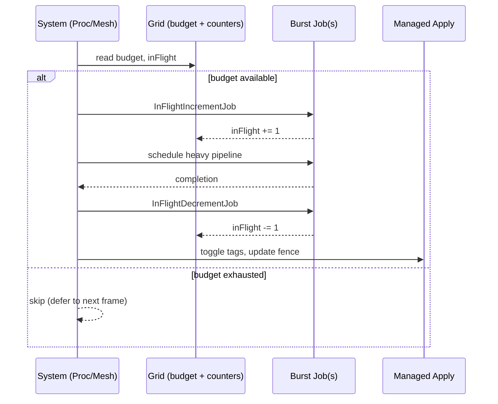

### Meshing budget and in‑flight tracking (per‑grid)

#### Summary
This document specifies a per‑grid, count‑only meshing budget and in‑flight tracking for progressive background processing of large voxel grids. The budget limits the number of new chunk workloads admitted per frame, and the in‑flight counter ensures we do not exceed the budget while asynchronous jobs are still running. The policy applies uniformly to both procedural voxel generation and meshing systems.

#### Goals
- **Configurable budget** per grid: `maxMeshesPerFrame` (count only).
- **Progressive meshing** during level load (e.g., 10 per frame), and reduced steady‑state cost at runtime (e.g., 2 per frame).
- **Accurate in‑flight accounting** across frames and systems using atomic counters updated by jobs.
- **Completion event** on the grid when all chunks apply their first mesh, suitable for restoring a lower budget.

#### Non‑Goals
- No time‑slice budgets (no `timeSliceMs`).
- No changes to meshing algorithms, vertex formats, or memory layout.

---

### Components and Data Contracts

- `NativeVoxelGrid.MeshingBudget : IComponentData`
  - Fields: `int maxMeshesPerFrame` (default: 2)
  - Purpose: Count‑only per‑grid admission budget per frame.

- `NativeGridMeshingCounters : ICleanupComponentData, INativeDisposable`
  - Fields: `NativeReference<int> inFlight`
  - Purpose: Persistent, per‑grid in‑flight counter for asynchronous work across frames. Jobs use an `UnsafeAtomicCounter32` over this reference to add/subtract.

- `GridMeshingProgress : IComponentData`
  - Fields: `int totalChunks`, `int meshedOnceCount`, `bool firedOnce`
  - Purpose: Track grid completion for the initial population.

- `NativeVoxelGrid.FullyMeshedEvent : IComponentData, IEnableableComponent`
  - Purpose: Raised (enabled) exactly once when all chunks have applied their first mesh.

- `MeshedOnce : IComponentData, IEnableableComponent` (per chunk)
  - Purpose: Marks that a chunk has applied at least one mesh, used to increment grid progress exactly once.

#### Job helpers (Burst/Jobs)

```csharp
// Pseudocode signatures
public struct InFlightIncrementJob : Unity.Jobs.IJob
{
  public Unity.Collections.LowLevel.Unsafe.UnsafeAtomicCounter32 counter;
  public void Execute() { counter.Add(1); }
}

public struct InFlightDecrementJob : Unity.Jobs.IJob
{
  public Unity.Collections.LowLevel.Unsafe.UnsafeAtomicCounter32 counter;
  public void Execute() { counter.Add(-1); }
}
```

Jobs are scheduled to bracket the heavy work (procedural generation or meshing). The `UnsafeAtomicCounter32` is constructed from the `NativeReference<int>` via `GetUnsafePtr()` when scheduling.

---

### Grid Association

- Chunk entities carry `NativeVoxelChunk { gridID }`.
- Systems gate workloads per grid by resolving `gridID` for each chunk entity.
- Entities without a grid association (no `NativeVoxelChunk`) are not budget‑gated.

---

### Scheduling Policy (shared across systems)

Per update (frame):
- Build a small map of `gridID → { budget: int, inFlightRef: NativeReference<int>, scheduledThisFrame: int }` by querying grids for `NativeVoxelGrid`, `NativeVoxelGrid.MeshingBudget`, and `NativeGridMeshingCounters`.
- For each candidate chunk entity in the system’s query:
  - Resolve `gridID`; read `inFlightSnapshot = inFlightRef.Value` once per frame (acceptable eventual consistency).
  - If `inFlightSnapshot + scheduledThisFrame >= budget`, skip this entity this frame (leave its `Needs*` tag enabled).
  - Otherwise, admit the work:
    - Schedule `InFlightIncrementJob`.
    - Schedule the heavy pipeline (generator or meshing) dependent on increment.
    - Schedule `InFlightDecrementJob` dependent on pipeline completion.
    - Update the entity’s fence with the decrement job.
    - Update tags (disable `NeedsRemesh` or `NeedsProceduralUpdate`, enable `NeedsManagedMeshUpdate` as appropriate).
    - Increment `scheduledThisFrame` for this grid.

Notes:
- The in‑flight counter is shared across both systems, so the combined admitted workloads for a grid per frame will not exceed the configured budget once in‑flight work is considered.
- Work deferred due to budget remains eligible on subsequent frames.

---

### System Integration

#### ProceduralVoxelGenerationSystem

- Query: `PopulateWithProceduralVoxelGenerator`, `RefRO<NativeVoxelObject>`, `RefRO<NativeVoxelMesh>`, `RefRO<LocalToWorld>`, with `NeedsProceduralUpdate`.
- Gating:
  - Determine `gridID` if the entity is also a chunk (has `NativeVoxelChunk`). If not a chunk, skip gating.
  - Apply the shared scheduling policy.
- Pipeline bracketing:
  - `InFlightIncrementJob` → `generator.Schedule(...)` → `InFlightDecrementJob`.
  - Use the decrement job as the new fence for the entity via `VoxelJobFenceRegistry.UpdateFence`.
- Tags:
  - Disable `NeedsProceduralUpdate`, enable `NeedsRemesh` (unchanged behavior) after admission.

#### VoxelMeshingSystem

- Query: `RefRW<NativeVoxelMesh>`, `VoxelMeshingAlgorithmComponent`, with `NeedsRemesh`.
- Gating:
  - Resolve `gridID` via `NativeVoxelChunk` when present.
  - Apply the shared scheduling policy.
- Pipeline bracketing:
  - `InFlightIncrementJob` → `MeshingScheduling.ScheduleAlgorithm(...)` → `UploadMeshJob` → `InFlightDecrementJob`.
  - Use the decrement job as the updated fence via `VoxelJobFenceRegistry.UpdateFence`.
- Tags:
  - Disable `NeedsRemesh`, enable `NeedsManagedMeshUpdate` upon admission.

#### ManagedVoxelMeshingSystem (completion event)

- After `nvm.ApplyMeshManaged()` succeeds for a chunk:
  - If `MeshedOnce` not yet enabled: enable it, resolve `gridID`, increment `GridMeshingProgress.meshedOnceCount`.
  - If `meshedOnceCount == totalChunks && !firedOnce`: enable `NativeVoxelGrid.FullyMeshedEvent` and set `firedOnce = true`.

---

### Sequence Diagram



---

### Defaults and Usage

- Defaults on grid creation:
  - `MeshingBudget.maxMeshesPerFrame = 2`.
  - `FullyMeshedEvent` disabled.
  - `GridMeshingProgress.totalChunks` is set after chunk allocation.

- Example (level load → runtime):

```csharp
// During level load
em.SetComponentData(grid, new NativeVoxelGrid.MeshingBudget { maxMeshesPerFrame = 10 });

// Wait for fully meshed event (polled or via system reacting to enabled tag)
if (em.IsComponentEnabled<NativeVoxelGrid.FullyMeshedEvent>(grid))
{
  // Reduce budget for runtime edits
  em.SetComponentData(grid, new NativeVoxelGrid.MeshingBudget { maxMeshesPerFrame = 2 });
}
```

---

### Scene Loading and Preloader Integration

#### Lifecycle with `VoxelMeshGrid`

1) Scene loads (additively or single).
2) Each `VoxelMeshGrid` MonoBehaviour `Awake()` calls `CreateVoxelMeshGridEntity(...)`, which creates a grid entity with:
   - `NativeVoxelGrid`, `MeshingBudget` (default 2), `NeedsChunkAllocation` enabled,
   - `LinkedEntityGroup` containing the grid root.
3) `GridChunkAllocationSystem` runs in Initialization group, spawns chunk entities and sets `GridMeshingProgress.totalChunks`.
4) `GridNeedsTagPropagationSystem` mirrors any grid `Needs*` to its chunks.
5) `ProceduralVoxelGenerationSystem` (if present) and `VoxelMeshingSystem` begin admitting workloads per grid budget, updating shared in‑flight counters.
6) `ManagedVoxelMeshingSystem` applies results and advances `GridMeshingProgress`; `FullyMeshedEvent` is enabled when the grid is fully populated.

#### Preloader responsibilities (future gameplay system)

- Load scene(s) additively, then set high budgets (e.g., 10) on all grids to speed up initial population.
- Monitor per‑grid progress via `GridMeshingProgress` and the enableable `NativeVoxelGrid.FullyMeshedEvent`.
- When a grid is fully meshed, reduce its budget to the steady‑state value (e.g., 2).
- Aggregate progress across all grids to present a single loading bar.

#### Grid discovery and mapping

- Discover grid entities by querying ECS for `NativeVoxelGrid`.
- Optional: map back to scene `VoxelMeshGrid` GameObjects via `EntityGameObjectInstanceIDAttachment` if you need scene object references (each `VoxelMeshGrid` passed its `gameObject.GetInstanceID()` when creating the entity).

#### Readiness and ordering notes

- `GridMeshingProgress.totalChunks` is only known after `GridChunkAllocationSystem` runs; a preloader should wait until either:
  - `NeedsChunkAllocation` is disabled on the grid, or
  - `GridMeshingProgress.totalChunks > 0`.
- Counter allocation (`NativeGridMeshingCounters`) is automatic; queries that set budgets can run immediately after scene load.

#### Preloader pseudocode

```csharp
// Example sketch; production code should add error handling and cancellation.
IEnumerator LoadLevelAdditiveAndMesh(string sceneName)
{
  // 1) Load scene additively
  var op = SceneManager.LoadSceneAsync(sceneName, LoadSceneMode.Additive);
  while (!op.isDone) yield return null;

  // Make sure all grid entities are inserted
	yield return null;

  // 2) Acquire ECS world and discover grids
  var world = World.DefaultGameObjectInjectionWorld;
  var em = world.EntityManager;

  // 3) Build list of grids
  var grids = new List<Entity>();
  using (var q = em.CreateEntityQuery(typeof(NativeVoxelGrid)))
    grids.AddRange(q.ToEntityArray(Unity.Collections.Allocator.Temp));

  // 4) Escalate budgets during initial population
  foreach (var g in grids)
    em.SetComponentData(g, new NativeVoxelGrid.MeshingBudget { maxMeshesPerFrame = 10 });

  // 5) Wait for chunk allocation (optional but recommended)
  bool AllTotalsKnown()
  {
    foreach (var g in grids)
    {
      if (!em.HasComponent<GridMeshingProgress>(g)) return false;
      var prog = em.GetComponentData<GridMeshingProgress>(g);
      if (prog.totalChunks <= 0) return false;
    }
    return true;
  }
  while (!AllTotalsKnown()) yield return null;

  // 6) Monitor progress until all grids fully meshed
  bool AllDone()
  {
    foreach (var g in grids)
    {
      if (!em.IsComponentEnabled<NativeVoxelGrid.FullyMeshedEvent>(g)) return false;
    }
    return true;
  }

  while (!AllDone())
  {
    // Aggregate progress
    int total = 0, done = 0;
    foreach (var g in grids)
    {
      var prog = em.GetComponentData<GridMeshingProgress>(g);
      total += math.max(0, prog.totalChunks);
      done += math.clamp(prog.meshedOnceCount, 0, prog.totalChunks);
    }
    float progress = total > 0 ? (float)done / total : 0f;
    // TODO: report progress to UI
    yield return null;
  }

  // 7) Reduce budgets for steady state
  foreach (var g in grids)
    em.SetComponentData(g, new NativeVoxelGrid.MeshingBudget { maxMeshesPerFrame = 2 });

  // 8) Optionally set active scene or signal ready
}
```

#### Concurrency considerations

- Admission control uses the shared in‑flight counter; a higher per‑grid budget accelerates initial population without starving other grids.
- When loading multiple scenes additively, budgets remain per grid. The preloader should avoid setting excessively high values across many grids to keep frame time predictable.

---

### Performance and Concurrency

- The per‑frame budget map is tiny (per grid) and built once per system update.
- Increment/decrement jobs are trivial and Burst‑friendly.
- Fences chain through the decrement job to ensure in‑flight reaches zero exactly when the pipeline finishes for that entity.
- Skipped entities retain their `Needs*` tag and will be reconsidered next frame.

---

### Testing Requirements

- Budget adherence: with `maxMeshesPerFrame = N`, admitted workloads per grid do not exceed `N` per frame (considering in‑flight from prior frames).
- Cross‑system accounting: combined procedural + meshing in‑flight does not exceed budget.
- Event correctness: `FullyMeshedEvent` is enabled exactly once after all chunks apply their first mesh.
- Progress counters: `meshedOnceCount` increments exactly once per chunk.
- Stability under rapid edits and large queues: no deadlocks, counters converge to zero.

---

### Migration and Backward Compatibility

- Adds new components/tags only; existing algorithms and data remain unchanged.
- Default budget (2) approximates current behavior with minimal throughput change; setting higher values temporarily enables faster initial population.

---

### Future Work

- Optional time‑slice budgets (disabled by design in this spec).
- Priority queues (e.g., visible‑first) on top of the same admission control.
- Telemetry surfaces (queue length, in‑flight, p50/p95 job times) for tuning.


