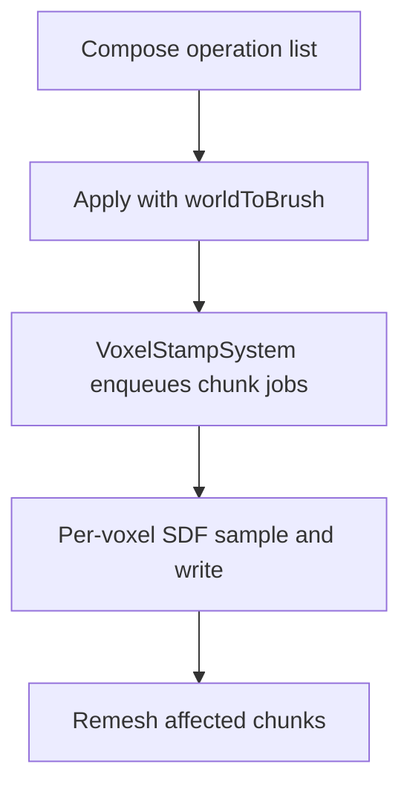

## SDF Brush DSL and Reusable Brush Definitions (Future Plan)

### Overview
- **Goal**: Author complex voxel edits using a simple managed DSL. Build a composite brush once, then apply it many times with different transforms and overrides.
- **Key ideas**:
	- **Single-pass operation list**: a contiguous native buffer (`NativeArray<SdfOp>`) processed sequentially in Burst
	- **Boolean CSG**: union, subtract, intersect, with smooth variants
	- **Final transform**: apply built brush at arbitrary position/rotation/scale
	- **Collectors**: cluster-level material stats (centers and counts) for lightweight visualization

### Goals
- **Ergonomics**: Pure, minimal runtime API; trivial authoring into a list of ops
- **Performance**: Allocation-free stamping path, Burst-compatible data, bounded op counts
- **Extensibility**: Add new shapes and blends via enums and packed parameters
- **Reusability**: Define once → stamp many (instances with per-use transform/overrides)

### Developer API (sketch)
```csharp
// Define operations (conceptual)
NativeArray<SdfOp> ops;

// Apply many times
VoxelAPI.ApplyOps(ops, float4x4.TRS(pos, rot, new float3(1f)), collector: VoxelEditCollector.MaterialClusters(clusters));
```

### Data Model
- **Immutable definition (native buffer)**
	- `struct SdfOp { ShapeType shape; BlendOp blend; float k; float4 p0; float4 p1; byte material; float strength01; }`
	- Stored/consumed as `NativeArray<SdfOp>`
- **Stamp instance**
	- `struct VoxelBrushStamp : IComponentData`
		- `NativeArray<SdfOp> ops`
		- `MinMaxAABB boundsWorld`
		- `float4x4 worldToBrush`
		- `VoxelEditCollector collector` // optional

### Shapes and blends (runtime enums)
```csharp
public enum ShapeType : byte { Sphere, BoxAA, Box, RoundedBox, Ellipsoid, Cylinder, Capsule, Torus, Cone, Plane }
public enum BlendOp   : byte { Replace, Union, Subtract, Intersect, SmoothUnion, SmoothSubtract, SmoothIntersect }
public struct SdfOp
{
	public ShapeType shape;
	public BlendOp blend;
	public float k;      // smoothing param for smooth blends; 0 for sharp
	public float4 p0;    // packed: e.g., center.xyz, radius (w)
	public float4 p1;    // packed: e.g., halfExtents.xyz or rotation
	public byte material;
	public float strength01;
}
```

### Voxel API (operation list)
```csharp
public static class VoxelAPI
{
	public static void ApplyOps(
		in NativeArray<SdfOp> ops,
		in float4x4 brushToWorld,
		in VoxelEditCollector collector = default);
}
```

### Burst SDF/material sampling (runtime)
```csharp
public struct SdfSample
{
	public float s;       // inside-positive distance
	public byte material; // material from dominant op at this point
}

public static class SdfSampler
{
	// Fast path: SDF-only
	public static float SampleSdf(in NativeArray<SdfOp> ops, in float3 positionWorld, in float4x4 worldToBrush);
	// SDF + material selected from the op contributing the final value
	public static SdfSample Sample(in NativeArray<SdfOp> ops, in float3 positionWorld, in float4x4 worldToBrush);
}
```

```pseudo
Sampling algorithm (conceptual):
- Transform: pB = (worldToBrush * float4(pW,1)).xyz
- Iterate ops sequentially, maintain (s, material)
- For each op: evaluate shape SDF in brush space, blend with current using op.blend (smooth if k>0)
	- Choose material from the contributing branch: for max/min pick the arg winner; for smooth blends, choose by blend weight threshold
- Return inside-positive distance (brush-space units) and the selected material
```

### Authoring
- Provide operations by filling a `NativeArray<SdfOp>` (or `NativeList<SdfOp>` then copy to array).
- Each op is self-contained (shape, blend, parameters, optional material/strength).

### Optional builder sugar (authoring convenience)
```csharp
public static class SdfShapes
{
	public static SdfOp Sphere(float radius, float3 center, BlendOp blend, byte material);
	public static SdfOp BoxAA(float3 halfExtents, float3 center, BlendOp blend, byte material);
	public static SdfOp Box(float3 halfExtents, float3 center, quaternion rotation, BlendOp blend, byte material);
	public static SdfOp RoundedBox(float3 halfExtents, float radius, float3 center, quaternion rotation, BlendOp blend, byte material);
	public static SdfOp Ellipsoid(float3 radii, float3 center, quaternion rotation, BlendOp blend, byte material);
	public static SdfOp Cylinder(float radius, float halfHeight, float3 center, quaternion rotation, BlendOp blend, byte material);
	public static SdfOp Capsule(float3 pointA, float3 pointB, float radius, BlendOp blend, byte material);
	public static SdfOp Torus(float majorRadius, float minorRadius, float3 center, quaternion rotation, BlendOp blend, byte material);
	public static SdfOp Cone(float baseRadius, float height, float3 apex, quaternion rotation, BlendOp blend, byte material);
	public static SdfOp Plane(float3 normal, float distance, BlendOp blend, byte material);
}

public struct SdfOperationBuilder
{
	public static SdfOperationBuilder New(Allocator allocator);
	public SdfOperationBuilder Add(in SdfOp op);
	public NativeArray<SdfOp> Build();
}
```

```csharp
using static SdfShapes;

SdfOperationBuilder.New(Allocator.TempJob)
	.Add(Sphere(radius: 10, center: float3(0,0,0), blend: BlendOp.Replace, material: 1))
	.Build();
```

### Systems and Jobs
- `VoxelStampSystem` processes `VoxelBrushStamp` entities:
	- Query chunks intersecting `boundsWorld`
	- Schedule per-chunk jobs that iterate voxels and call `SdfSampler.Sample(ops, pW, worldToBrush)` to get both SDF and material
	- Map SDF via `StampOperation`, select material policy, write SDF/material; fence and remesh

#### Procedural Generators: two-phase scheduling (`IProceduralVoxelGenerator`)
- Standardize generators to schedule SDF and Material as separate phases for clarity and decoupling:
```csharp
public interface IProceduralVoxelGenerator
{
	JobHandle ScheduleSdf(
		MinMaxAABB localBounds,
		float4x4 transform,
		float voxelSize,
		VoxelVolumeData data,
		JobHandle inputDeps);

	JobHandle ScheduleMaterial(
		MinMaxAABB localBounds,
		float4x4 transform,
		float voxelSize,
		VoxelVolumeData data,
		JobHandle inputDeps);
}
```
- Back-compat: a composite `Schedule(...)` can call both and return their fence (or chain material after SDF if it depends on generated geometry).

### Collectors (cluster-based)
```csharp
public struct MaterialClusterKey { public byte material; public int clusterId; }
public struct MaterialClusterValue { public float3 centerWorld; public int count; }
public struct VoxelEditCollector
{
	public static VoxelEditCollector None();
	public static VoxelEditCollector MaterialClusters(NativeHashMap<MaterialClusterKey, MaterialClusterValue> clusters);
}
```
- **MaterialClusters**: aggregates voxel edits into spatial clusters per material for lightweight visualization.

### Bounds and Transform
- Brush-space bounds: packed per-op; merged conservatively at authoring
- World-space bounds for queries:
	- `centerWorld = mul(R, centerB) + t`, `extentsWorld = abs(R) * extentsB`

### Mermaid Flow


### Recipes

#### Hemisphere (Sphere ∩ Half-space)
- **Idea**: Build a sphere, then intersect it with a plane half-space to keep only one side (e.g., y ≥ 0).
- **Plane parameters**: `normal` points toward the kept side; `distance` is signed offset along `normal` in brush-space.

```csharp
using static SdfShapes;

var builder = SdfOperationBuilder.New(Allocator.TempJob)
	.Add(
		Sphere(
			radius: 10f,
			center: new float3(0f, 0f, 0f),
			blend: BlendOp.Replace,
			material: 1))
	.Add(
		Plane(
			normal: new float3(0f, 1f, 0f), // keep the y ≥ 0 half
			distance: 0f,                    // plane passes through origin
			blend: BlendOp.Intersect,
			material: 1));

var ops = builder.Build();
```

- **Smoothed cap**: Use a smooth intersection by setting a nonzero smoothing `k` on the plane op.

```csharp
var planeOp = Plane(
	normal: new float3(0f, 1f, 0f),
	distance: 0f,
	blend: BlendOp.SmoothIntersect,
	material: 1);

planeOp.k = 0.75f; // smoothing radius in brush-space units

var opsSmooth = SdfOperationBuilder.New(Allocator.TempJob)
	.Add(Sphere(10f, new float3(0f,0f,0f), BlendOp.Replace, 1))
	.Add(planeOp)
	.Build();
```

### Sampling on populated chunked SDF volumes (reliability)
- **Inside-positive convention**: This doc assumes inside-positive SDF (inside > 0, outside < 0).
- **Two-level composition**:
	- Level 1 (brush): compose `ops` → `sBrush(pW)` using CSG within the brush
	- Level 2 (stamp): combine `sBrush(pW)` with the existing field `sExisting(pW)` using a stamp op
- **CSG (brush, level 1)**:
	- `Union(a,b)` → `max(a,b)`
	- `Intersect(a,b)` → `min(a,b)`
	- `Subtract(a,b)` → `min(a, -b)`
	- Smooth variants use smoothMax/smoothMin with radius `k` (and `smoothSubtract(a,b,k) = smoothMin(a, -b, k)`)

```csharp
public enum StampOp : byte { Replace, Union, Intersect, Subtract }

// Level 2 combination with existing field (inside-positive)
public static float CombineWithExisting(float sExisting, float sBrush, StampOp stampOp, float strength01, float narrowBand)
{
	float target = sExisting;
	switch (stampOp)
	{
		case StampOp.Replace:
			target = sBrush; break;
		case StampOp.Union:
			target = math.max(sExisting, sBrush); break;
		case StampOp.Intersect:
			target = math.min(sExisting, sBrush); break;
		case StampOp.Subtract:
			target = math.min(sExisting, -sBrush); break; // keep inside existing and outside brush
	}
	// Strength lets edits feather into existing content
	float sNew = math.lerp(sExisting, target, strength01);
	// Optional: keep a narrow band for stability/perf
	return math.clamp(sNew, -narrowBand, narrowBand);
}
```

#### Hemisphere reliability on existing volumes
- Build the hemisphere in Level 1 as `Intersect(Sphere, HalfSpace)` (or smooth variant). This yields a brush SDF `sBrush` with a sharp or rounded cap.
- In Level 2, choose how it interacts with the existing world:
	- **Place/Carve**: `Union` to add terrain; `Subtract` to cut into terrain
	- **Overwrite**: `Replace` to fully set geometry to the hemisphere

```csharp
// Per-chunk job outline (no races; each thread writes a unique voxel)
// Inputs: chunk origin O, voxel size h, dims (Nx,Ny,Nz), worldToBrush M, ops[], stampOp, strength01
for (int kz = 0; kz < Nz; kz++)
for (int ky = 0; ky < Ny; ky++)
for (int kx = 0; kx < Nx; kx++)
{
	float3 pW = O + h * new float3(kx + 0.5f, ky + 0.5f, kz + 0.5f); // sample at voxel centers
	float sExisting = volume[kx, ky, kz];
	byte mExisting = materials[kx, ky, kz];

	SdfSample sb = SdfSampler.Sample(ops, pW, M); // inside-positive + material
	float sBrush = sb.s;
	byte mBrush = sb.material;

	float sNew = CombineWithExisting(sExisting, sBrush, stampOp, strength01, narrowBand);
	byte mNew = SelectMaterialForStamp(mExisting, mBrush, sExisting, sBrush, stampOp);

	volume[kx, ky, kz] = sNew;
	materials[kx, ky, kz] = mNew;
}
```

```csharp
// Material selection follows the branch contributing the target field (pre-lerp)
public static byte SelectMaterialForStamp(byte mExisting, byte mBrush, float sExisting, float sBrush, StampOp stampOp)
{
	switch (stampOp)
	{
		case StampOp.Replace:   return mBrush;
		case StampOp.Union:     return (sBrush >= sExisting) ? mBrush : mExisting;     // max
		case StampOp.Intersect: return (sBrush <= sExisting) ? mBrush : mExisting;     // min
		case StampOp.Subtract:  return ((-sBrush) < sExisting) ? mBrush : mExisting;   // min(sExisting, -sBrush)
	}
	return mBrush;
}
```

#### Chunk boundary invariants
- **World-space evaluation**: Always sample the brush in world space (`pW`) using a single `worldToBrush` transform. This guarantees the same `sBrush` on both sides of a chunk boundary.
- **Expanded ROI**: When scheduling chunk jobs for a brush, expand the world bounds by `margin = max(k, h*1.5f, narrowBand)` and include any chunk whose AABB intersects the expanded bounds.
- **Apron/border cells**: Ensure a 1–2 voxel apron is coherent across neighbors:
	- Option A (exclusive writes): assign ownership of shared edges/faces to the chunk with the lower index on that axis; only the owner writes those cells.
	- Option B (overlapped aprons): each chunk has read-only aprons mirrored from neighbors; after writing interiors, run a fast border copy/sync step.
- **Deterministic order**: If multiple stamps overlap, apply them in a deterministic order per chunk (e.g., creation index), or compose multiple brushes first, then do a single Level 2 combine pass.
- **Numeric stability**: Prefer fused transforms, clamp to a narrow band, and use consistent `k` and `strength01` across chunks for the same stamp.

### Notes
- This simplified design supersedes previous DSL/graph concepts.
- Extending shapes/blends adds new enum values and shape evaluators; no pipeline changes.


