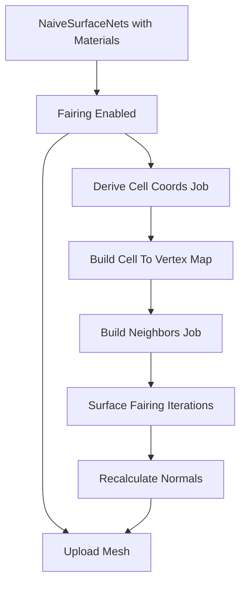

## Surface Fairing Optimization Plan (Approach A + B + I)

### Summary
We rework `NaiveSurfaceNets` to output discrete material IDs directly (same labeling policy as the paper and as implemented in `FairSurfaceNets`). Surface fairing is split into an independent, optional post-process pipeline that runs after `NaiveSurfaceNets`. The pipeline uses a dense cell map for O(1) neighbor access (B), Burst-parallel jobs with ping‑pong position buffers (A), and scheduling/memory layout tweaks (I). This keeps the core extractor fast while making fairing scalable and configurable.

References:
- SurfaceNets for Multi-Label Segmentations with Preservation of Sharp Boundaries (JCGT 2022) [paper](https://jcgt.org/published/0011/01/03/paper.pdf)

### Goals
- Decouple fairing from extraction (off by default) with minimal overhead when disabled
- Preserve discrete segmentation and sharp boundaries per the paper
- Reduce per-iteration cost using precomputed neighbor access and cache-friendly data
- Provide easy knobs: iterations, step size, cell margin, normals recompute

### Non‑Goals
- We do not change `NaiveSurfaceNets` behavior or performance
- We do not introduce material blending; materials remain discrete
- We do not move extraction to GPU; fairing remains CPU/Burst

---

## High-Level Architecture



### Plan Change: Materials in NaiveSurfaceNets
- `NaiveSurfaceNets` now encodes the dominant material ID per vertex in `vertex.color.r` (0–255), using the nearest-corner rule within the owning cell. This matches the discrete segmentation requirement and avoids any blending.
- Remove material extraction from any separate mesher; fairing operates purely on positions (and optional normals), reading existing material IDs for boundary-aware step sizing.

### Data Layout (B)
- CHUNK_SIZE = 32 (6 bits/axis); define dense cell map sized `(CHUNK_SIZE x CHUNK_SIZE x CHUNK_SIZE)` storing `int vertexIndex` or `-1`.
- Cell key packing (optional helper): `key = (x << 20) | (y << 10) | z` (for debugging / assertions). For the dense map, use `index = x*CS*CS + y*CS + z` directly.
- Neighbor model: face neighbors only (±X, ±Y, ±Z). Precompute for each vertex:
  - `neighborIndexRanges: NativeArray<int2>` (start, count)
  - `neighborIndices: NativeArray<int>` (flattened adjacency)

### Jobs and Contracts (A, B)

1) DeriveCellCoordsJob (IJobParallelFor)
- Input: `NativeArray<float3> positions`, `float voxelSize`
- Output: `NativeArray<int3> cellCoords`, `NativeArray<int> cellLinearIndex`
- Logic: `cellCoords[i] = (int3)floor(positions[i] / voxelSize + 1e-6f)`; clamp to `[0, CHUNK_SIZE-1]`

2) BuildCellToVertexMap (IJob)
- Input: `NativeArray<int> cellLinearIndex`
- Output: `NativeArray<int> cellToVertex (size = CS*CS*CS, init -1)`
- Logic: For each vertex (sequential or with atomic CAS in parallel), assign `cellToVertex[cellIndex] = i` if empty; otherwise keep first. This mimics one-vertex-per-cell of Surface Nets.

3) BuildNeighborsJob (IJobParallelFor)
- Input: `NativeArray<int3> cellCoords`, `NativeArray<int> cellToVertex`
- Output: `NativeArray<int2> neighborIndexRanges`, `NativeArray<int> neighborIndices`
- Logic: For vertex i, probe up to 6 neighbors by adding ± unit axis and reading `cellToVertex`. Append valid indices to `neighborIndices` and record `(start,count)` in `neighborIndexRanges[i]`.

4) SurfaceFairingJob (IJobParallelFor) — run K iterations with ping‑pong arrays
- Input: `NativeArray<float3> inPositions`, `NativeArray<int2> neighborIndexRanges`, `NativeArray<int> neighborIndices`, `NativeArray<byte> materialId`, `NativeArray<int3> cellCoords`, constants `voxelSize`, `cellMargin`, `fairingStepSize`
- Output: `NativeArray<float3> outPositions`
- Logic per vertex i:
  - Average neighbor positions (face neighbors only)
  - Adaptive step: reduce step size if any neighbor has different material (sharp boundary preservation per paper)
  - Move toward average: `p' = p + alpha * (avg - p)`
  - Constrain to original cell bounds (scaled margin):
    ```
    scaledMargin = cellMargin * voxelSize
    min = cellCoords[i]*voxelSize + scaledMargin
    max = (cellCoords[i]+1)*voxelSize - scaledMargin
    p' = clamp(p', min, max)
    ```

5) RecalculateNormalsJob (IJobParallelFor) (optional)
- Input: `indices`, `positions`
- Output: `normals`
- Logic: one pass to accumulate triangle normals, then normalize in a second pass or within same job using atomic-free per-vertex accumulation strategy (if index duplication is avoided); otherwise do two-phase jobs (accumulate, then normalize).

### Scheduling & Memory (I)
- Use `IJobParallelFor` with tuned batch size (e.g., 64–256) for `BuildNeighborsJob`, `SurfaceFairingJob`, and `RecalculateNormalsJob`.
- Ping‑pong positions: `positionsA → positionsB → positionsA ...` for K iterations.
- Schedule in sequence; call `JobHandle.ScheduleBatchedJobs()` after enqueueing each batch group.
- Avoid `Complete()` until positions are needed for upload.
- Keep SoA where practical (separate arrays for positions, normals) to improve cache.
- Allocate fairing buffers per chunk; dispose at the end of pipeline.

### Integration (NaiveSurfaceNets provides materials)
- `NaiveSurfaceNets` outputs vertices/indices and discrete material IDs (vertex color R channel).
- Add fields to `VoxelMeshingAlgorithmComponent`:
  - `bool enableFairing; int fairingIterations; float fairingStepSize; float cellMargin; bool recomputeNormalsAfterFairing;`
- In `VoxelMeshingSystem`:
  - If `enableFairing` is false → upload immediately.
  - If true → schedule: `DeriveCellCoordsJob → BuildCellToVertexMap → BuildNeighborsJob → Kx SurfaceFairingJob → (optional) RecalculateNormalsJob → Upload`.

### Boundary Preservation (per paper)
- Materials are discrete. No blending.
- Sharp boundaries preserved by detecting neighbor material changes and reducing step size near boundaries.
- Matches guidance in the SurfaceNets paper for multi-label segmentations ([paper](https://jcgt.org/published/0011/01/03/paper.pdf)).

### Performance Expectations
- `NaiveSurfaceNets` unchanged (~0.1 ms per chunk reported).
- One-time neighbor build cost amortized across K iterations.
- Typical speedups vs. per-iteration neighbor scans: 2–5× for K=3–10; higher for larger vertex counts.

### Memory Considerations
- Additional buffers per chunk:
  - `cellToVertex: int[CS*CS*CS]`
  - `cellCoords: int3[numVerts]`, `neighborIndexRanges: int2[numVerts]`, `neighborIndices: ~6*numVerts worst‑case`
  - `positions ping‑pong: 2 * float3[numVerts]`
- All allocated with TempJob or Persistent depending on lifetime in pipeline.

### Testing & Benchmarks
- Micro-benchmarks per step (neighbor build, single iteration, total pipeline) vs. existing fairing.
- Visual tests for:
  - Smooth single material surfaces
  - Sharp multi-material boundaries
  - Varying `voxelSize` scaling (cell constraints stay correct)
- Convergence vs. iteration count K (3,5,10).

### Risks & Mitigations
- Risk: Dense map wastes memory for sparse vertex distributions → acceptable given CS=32 and one vertex per cell in Surface Nets.
- Risk: Boundary artifacts if cell derivation is off-by-one → clamp and +eps in floor; unit tests.
- Risk: Over-smoothing sharp features → adaptive step and cell constraint mitigate.

### Rollout
1. Add discrete material assignment to `NaiveSurfaceNets` (nearest-corner within cell)
2. Implement data builders: DeriveCellCoords, CellToVertexMap, BuildNeighbors
3. Implement SurfaceFairing job and ping‑pong orchestration
4. Integrate scheduling in `VoxelMeshingSystem`
5. Add normals recompute (optional)
6. Bench/validate, expose controls in authoring component

### Acceptance Criteria
- Feature flag off → identical performance and output to current `NaiveSurfaceNets`
- With fairing enabled → smooth surfaces, sharp material boundaries preserved, fairing time reduced by ≥2× vs. current baseline at K=5
- No GC allocations during jobs; Burst-compatible; no managed data in hot paths

---

## Verification of Approach and Alternatives

### Verification
- Implementing discrete materials in `NaiveSurfaceNets` is consistent with the SurfaceNets paper: segmentation is discrete, geometry can be faired later. Having a single extractor simplifies maintenance and keeps the hot path minimal. Fairing remains optional and reads material IDs for boundary-aware steps.

### Alternatives
- Separate extractors (keep `FairSurfaceNets` mesher): Increases code duplication and maintenance. Only beneficial if we want a materially different extraction strategy; not needed here.
- Post-process material labeling: Compute label per vertex from voxel labels after extraction. Equivalent result but adds another pass; embedding into extractor is simpler and cheaper.
- Compile-time flag for materials: Keep a build variant without material writes for minimal overhead in pure collision meshes. Useful if you need the absolute minimum footprint.
- GPU-based fairing: Potentially faster but adds complexity and data transfer; CPU/Burst path remains simpler and already highly performant.


