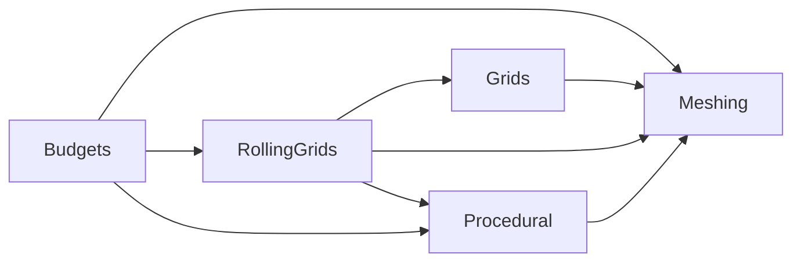

## VMF refactor execution plan (consolidated v1)

Date: 2025-09-06
Inputs: `domain_decomposition_plan_v1.md`, `vmf_static_helpers_refactor_plan_v1.md`
Scope: `Packages/com.voxelmeshframework/**`

### Summary
Consolidate the domain decomposition with the static-helper extraction strategy. Refactor into five domains (Procedural, Meshing, Grids, Budgets, Rolling Grids), keep behavior identical, enforce ≤200 LOC per file, and avoid logic duplication by reusing small static classes. Unity `ISystem`/MonoBehaviours act as thin orchestrators; computations/job scheduling live in pure/static helpers.

### Objectives
- Domain separation: Procedural, Meshing, Grids, Budgets, Rolling Grids
- Minimal files: ≤200 LOC, 1–2 top-level types per file
- Static helpers for shared logic; no wrapper methods with many parameters
- Preserve public API and performance characteristics
- Prefer `internal` + `InternalsVisibleTo` for tests

### Architecture and boundaries

Cross-cutting:
- Concurrency: `VoxelJobFenceRegistry` with a concise `VoxelFences` façade
- Bridge: split `VoxelEntityBridge` into partials (`Entities/Grids/Meshes/Rolling`)
- Diagnostics/Debug: keep static utilities; maintain lightweight marks/logging

### Detailed changes by domain

#### Rolling Grids
- Move components from `Core/Grids` to `Core/RollingGrids/Components/`:
  - `RollingGridConfig`, `RollingGridMoveRequest`, `RollingGridBatchActive`, `RollingGridCommitEvent`, `RollingGridState`
- Move system:
  - `Core/Meshing/Systems/RollingGridOrchestratorSystem.cs` → `Core/RollingGrids/Systems/RollingGridOrchestratorSystem.cs`
- Add static helpers (separate files):
  - `RollingMoveGuards`, `RollingStep`, `SlabSelection`, `SlabScheduling`, `CommitGate`
- Keep `OnUpdate` slim (≤100 LOC) composing the helpers.

Acceptance:
- All Rolling Grid tests pass; no behavior change in movement/commit
- Orchestrator file ≤100 LOC; helper files ≤200 LOC each

#### Meshing
- Keep: `VoxelMeshingSystem`, `MeshingScheduling`, `NaiveSurfaceNets*`, `SharedStaticMeshingResources`, `ManagedMeshCombine`
- `ManagedVoxelMeshingSystem` refactor:
  - `OnUpdate` (≤80 LOC) orchestrating:
    - `ManagedMeshApply.Run(...)`
    - `CommitBatchProcessor.Run(...)`
    - `MeshAttachers.AttachMeshFilter(...)`, `MeshAttachers.AttachMeshCollider(...)`
    - `GridProgress.UpdateOnMeshedOnce(...)`

Acceptance:
- Existing meshing/editor/perf tests pass; render parity is maintained
- No increase in per-frame managed allocations

#### Grids
- Keep: `GridChunkAllocationSystem`, `GridChunkHybridInstantiationSystem`, `GridMeshingProgress`, `NativeGridMeshingCounters`, `NativeVoxelGrid`, `NativeVoxelChunk`, `NeedsChunkAllocation`, `ChunkPrefabSettings`, `ChunkHybridReady`
- Add helpers:
  - `GridMath` (dims/stride/clamp), `ChunkEntityFactory` (archetype + initial components), `GridProgress` (centralized progress updates)
- Slim `GridChunkAllocationSystem` to call helpers.

Acceptance:
- Allocation and hybrid instantiation unchanged; progression counters correct
- Allocation system file ≤150 LOC; helpers ≤200 LOC

#### Procedural
- Keep: `ProceduralVoxelGenerationSystem`, tags/components, generators
- Add helper:
  - `ProceduralScheduling` for job submission + fence update + signal toggles

Acceptance:
- Procedural tests pass; no change in scheduling semantics

#### Budgets (new)
- Introduce budgeting without altering behavior initially (no-op tokens):
  - `BudgetAllocatorSystem` (issues per-frame tokens per policy)
  - `BudgetAccounting`/`FrameBudget` statics; `BudgetTokens` API
- Integrate gated checks in `VoxelMeshingSystem` and `ManagedVoxelMeshingSystem` behind a feature flag

Acceptance:
- Feature flag off: bitwise identical behavior
- Feature flag on: bounded meshes/uploads per frame by policy

### Cross-cutting changes
- Concurrency: add `VoxelFences` façade (thin wrappers to `VoxelJobFenceRegistry`)
- Bridge: split `VoxelEntityBridge` into partial files:
  - `VoxelEntityBridge.Entities.cs`, `.Grids.cs`, `.Meshes.cs`, `.Rolling.cs`
- Editor/Tests: prefer `internal` plus `InternalsVisibleTo` for access; update namespaces to new domains
- Naming: ensure filenames match classes; max 2 top-level types per file

### PR/phase breakdown
Phase 0 — Scaffolding (no behavior change)
- Create domain folders (`RollingGrids/`, `Budgets/`), add empty helpers (shells only)
- Add `VoxelFences` façade
- Criteria: builds/compiles; zero behavior change

Phase 1 — Rolling Grids move and helpers
- Move components + system to `RollingGrids/` and extract helpers
- Update imports/usings and tests
- Criteria: all Rolling Grid tests green; orchestrator ≤100 LOC

Phase 2 — Managed meshing split
- Extract `ManagedMeshApply`, `CommitBatchProcessor`, `MeshAttachers`, reuse `GridProgress`
- Criteria: managed allocs unchanged; editor/perf tests green

Phase 3 — Stamps guards and adjacency
- Extract interior-window guards and adjacency sync helpers from `VoxelStampSystem`
- Criteria: stamp tests/perf tests green

Phase 4 — Grids helpers
- Add `GridMath`, `ChunkEntityFactory`, refactor allocation system to statics
- Criteria: allocation behavior and progress counters unchanged

Phase 5 — Procedural scheduling helper
- Add `ProceduralScheduling` and slim `ProceduralVoxelGenerationSystem`
- Criteria: procedural tests pass; no behavioral regressions

Phase 6 — Budgets domain (feature-flagged)
- Add `BudgetAllocatorSystem` + accounting; integrate token checks behind flag
- Criteria: flag-off parity; flag-on bounded throughput

Phase 7 — Bridge partial split
- Split `VoxelEntityBridge` into partials; no signature changes
- Criteria: file sizes ≤200 LOC; tests compile

### Testing and verification
- Run existing unit/integration/performance suites; no regressions
- New unit tests for: `RollingStep`, `RollingMoveGuards`, `GridMath`, `BudgetAccounting`
- Profiling spot-checks: managed allocs/frame, job fences completion parity

### Risks and mitigations
- Namespace churn: execute per-domain PRs; IDE-assisted refactors
- Budget gating: feature flag with default off; gradual rollout
- Hidden coupling: extract helpers incrementally; keep system orchestration minimal

### Approval gate
This is a change proposal outline. On approval, proceed with Phase 0–1 PRs; pause after Phase 1 for review before continuing.

