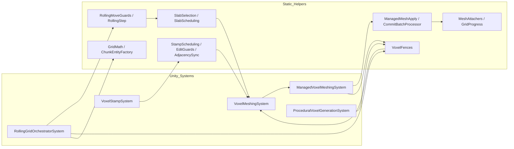

## VMF static-helpers refactor (v1)

Date: 2025-09-06
Scope: `Packages/com.voxelmeshframework/**`

### Summary
Keep runtime behavior identical while reducing complexity and file size. Extract orchestration logic from long systems into small static helper classes; split oversized utility classes using partials; enforce ≤200 LOC per file; keep Unity edges at adapters and use pure static “domain” helpers for scheduling/math/progress.

### Goals
- Minimal, readable files (≤200 LOC)
- Prefer static classes for shared functionality; avoid duplicating logic
- Thin `ISystem`/MonoBehaviour orchestrators; pure/static helpers for computation
- Stable public APIs; no breaking changes intended

### Guiding rules
- C# file/class naming: filename matches primary top-level class; keep ≤2 top-level types per file
- Code change protocol: propose split into small, cohesive modules; document rationale and impacts
- Code comments: comment only where non-obvious; focus on why/what at a high level
- Breathable code: add vertical whitespace between logical steps; avoid dense blocks
- Domain-oriented programming: keep domain helpers pure/static; isolate Unity/IO at edges

---

### Module-by-module plan

#### 1) Core/Config
- Location: `Core/Config`
- Changes:
  - Keep `VoxelProjectBootstrapSystem` (already small).
  - Add `ProjectConfigGuards` (static) for “is-configured” checks used by systems.
- Rationale: Centralize config reads; remove repeated null/default checks.

#### 2) Core/Concurrency
- Location: `Core/Concurrency/VoxelJobFenceRegistrySystem.cs`
- Changes:
  - Keep `VoxelJobFenceRegistry` API.
  - Add `VoxelFences` static façade with short names: `Get`, `Update`, `Complete`, `TryComplete`, `Reset`.
  - Update systems to use façade to reduce call-site verbosity.
- Rationale: Preserve proven registry; simplify use at call sites.

#### 3) Core/Authoring
- Location: `Core/Authoring/*`
- Changes:
  - Keep MonoBehaviours lean; delegate entity creation/mutation to the bridge.
- Rationale: Ensure bootstraps remain thin adapters around serialized data.

#### 4) Core/Bridge (NEW split of `VoxelEntityBridge`)
- Location: `Core/`
- Changes:
  - Convert to `internal static partial class VoxelEntityBridge` split into:
    - `VoxelEntityBridge.Entities.cs` (TryGetEntityManager, Destroy)
    - `VoxelEntityBridge.Grids.cs` (CreateVoxelMeshGridEntity, rolling config precompute)
    - `VoxelEntityBridge.Meshes.cs` (CreateVoxelMeshEntity)
    - `VoxelEntityBridge.Rolling.cs` (SendRollingMovementRequest)
  - Each file ≤200 LOC; signatures preserved. Tests access via `InternalsVisibleTo`.
- Rationale: Current file is large; partials improve navigability without behavior changes.

#### 5) Core/Grids
- Location: `Core/Grids/*`
- Changes:
  - Extract helpers:
    - `GridMath.cs` (dims/stride math; clamp to limits)
    - `ChunkEntityFactory.cs` (create chunk entity + initial components)
    - `GridProgress.cs` (update `GridMeshingProgress` in one place)
  - Slim `GridChunkAllocationSystem.OnUpdate` to a small orchestrator.
- Rationale: Reduce duplication and long methods.

#### 6) Core/Meshing/Systems – Managed apply
- Location: `Core/Meshing/Systems/ManagedVoxelMeshingSystem.cs`
- Changes:
  - Keep a slim `OnUpdate` (≤80 LOC) that composes statics:
    - `ManagedMeshApply.Run(...)` (per-entity fence-ready apply)
    - `CommitBatchProcessor.Run(...)` (commit-path apply + GO moves + flags)
    - `MeshAttachers.AttachMeshFilter/Collider(...)`
    - `GridProgress.UpdateOnMeshedOnce(...)`
  - Each helper in its own static class, each file ≤200 LOC.
- Rationale: Isolate concerns; improve testability and readability.

#### 7) Core/Meshing/Systems – Rolling grid
- Location: `Core/Meshing/Systems/RollingGridOrchestratorSystem.cs`
- Changes:
  - Replace long `OnUpdate` with composition of statics:
    - `RollingMoveGuards.Readiness(...)` (allocation/meshing-ready checks)
    - `RollingStep.ComputeStep(...)` (axis, sign, step anchor)
    - `SlabSelection.Collect(...)` (entering/interior sets)
    - `SlabScheduling.Generate(...)` (procedural)
    - `SlabScheduling.CopyAprons(...)`
    - `SlabScheduling.MeshAndUpload(...)`
    - `CommitGate.EmitWhenReady(...)`
- Rationale: Keep orchestration clear; encapsulate sub-steps.

#### 8) Core/Meshing – Algorithms & utilities
- Location: `Core/Meshing/*`
- Changes:
  - Keep `MeshingScheduling`, `NaiveSurfaceNets*`, `SharedStaticMeshingResources`, `ManagedMeshCombine` static (minor cleanups only).
- Rationale: Already cohesive and low-LOC.

#### 9) Core/Stamps
- Location: `Core/Stamps/*`
- Changes:
  - Move guards and adjacency sync out of `VoxelStampSystem` into:
    - `RollingGridEditGuards.CheckInteriorWindow(...)`
    - `AdjacencySync.CopySharedOverlapForBounds(...)`
  - Keep `StampScheduling` as the central job scheduler.
- Rationale: Keep `OnUpdate` focused on stamp iteration and signaling.

#### 10) Core/Procedural
- Location: `Core/Procedural/*`
- Changes:
  - If needed, introduce `ProceduralScheduling.Run(...)` to hold fence/signal toggles.
- Rationale: Maintain a consistent pattern with other systems.

#### 11) Core/Hybrid
- Location: `Core/Hybrid/*`
- Changes:
  - Add `HybridGameObjectLookup` static wrapper for `Resources.InstanceIDToObject`.
- Rationale: Thin managed edge; easier to unit test.

#### 12) Core/Spatial
- Location: `Core/Spatial/*`
- Changes:
  - If `VoxelSpatialSystem` grows >200 LOC, split helpers: `SpatialQueries`, `SpatialHash`, `SpatialAdapters` (statics).
- Rationale: Keep spatial ops pure/static and reusable.

#### 13) Diagnostics & Debugging
- Location: `Core/Diagnostics/*`, `Core/Debugging/*`
- Changes:
  - Keep static utilities; ensure breathable spacing; no API changes.
- Rationale: Already aligned with target style.

#### 14) Runtime API
- Location: `Packages/com.voxelmeshframework/Runtime/VoxelAPI.cs`
- Changes:
  - Keep minimal static façade. Optionally add `CreateGrid`, `DestroyById` wrappers if needed.
- Rationale: Provide tiny, stable user API.

#### 15) Editor, Samples, Tests
- Changes:
  - Update namespaces/usages if helper namespaces are introduced.
  - Prefer `internal` helpers and access tests via `InternalsVisibleTo`.
- Rationale: Maintain stable public surface; enable precise testing.

---

### Expected outcomes
- Shorter, skimmable systems with obvious control flow
- Shared, testable static helpers; no logic duplication
- Files ≤200 LOC; consistent spacing and naming
- No behavior change; performance unaffected or slightly improved

### Considerations
- Breaking changes: none intended (types/namespaces preserved)
- Migration: internal call-site updates only
- Testing: add unit tests for new static helpers; existing tests remain valid
- Performance: avoid allocations in hot paths; keep `SharedStatic` usage as-is

### Phased implementation (PRs)
1. Introduce helper folders and empty static shells; wire `InternalsVisibleTo`.
2. Split `VoxelEntityBridge` into partials; no logic changes.
3. Refactor `ManagedVoxelMeshingSystem` to statics.
4. Refactor `RollingGridOrchestratorSystem` to statics.
5. Extract `VoxelStampSystem` guards + adjacency.
6. Extract `GridMath`, `ChunkEntityFactory`, `GridProgress`.
7. Optional cleanup (Procedural/Hybrid small statics); update docs.

### Diagram (high level)

### Non-goals
- No algorithm changes to meshing/fairing/stamping
- No public API renames without necessity
- No dependency introductions; stay within current packages

### Rollback plan
- All refactors are extractions. If any regression occurs, revert the specific helper extraction or switch call-sites back to original in-system logic.

